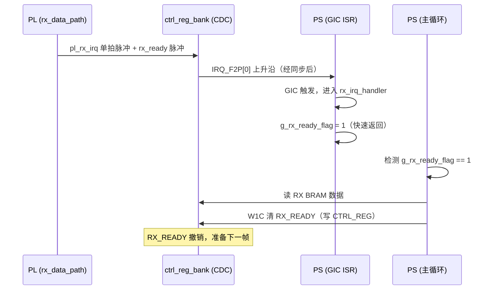
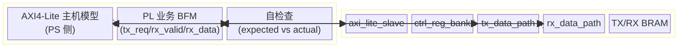

# Zynq\-7020 PS\-PL AXI4\-Lite BRAM 双向通信设计文档（优化版）

**版本**：V3\.1（修订版：修复地址译码/AXI握手/CDC/状态位清除等缺陷）
**开发环境**：Vivado 2018\.2
**目标芯片**：XC7Z020
**核心优化点**：

1. PS\-PL 总线接口升级为**标准 AXI4\-Lite 从机接口**，兼容 Zynq 原生总线架构

2. 地址空间明确划分为 **控制寄存器区（REG）** 与 **TDPRAM 数据区**，独立编址、地址译码分离

3. 收发通道完全物理独立，各配专属真双口 BRAM 与独立三段式状态机

4. 增加**跨时钟域同步机制**，解决 PS 高速 AXI 时钟与 PL 端 1MHz 异步时钟的亚稳态风险

5. 架构分层：协议层 → 寄存器层 → 数据通路层，模块边界清晰、可复用性强

---

## 一、整体架构设计

### 1\.1 系统分层架构

```Plaintext
┌────────────────────────────── PS 端 ──────────────────────────────┐
│                     ARM Cortex-A9 / AXI4-Lite 主机                 │
└───────────────────────────────┬───────────────────────────────────┘
                                │ AXI4-Lite 总线 (s_axi_aclk: 100MHz)
┌───────────────────────────────┴───────────────────────────────────┐
│                     axi_lite_slave 协议层                          │
│                地址译码 → REG区 / TX_BRAM / RX_BRAM                │
├───────────────────────┬───────────────────────────┬───────────────┤
│   ctrl_reg_bank       │      TX_TDPRAM            │  RX_TDPRAM    │
│   控制寄存器组        │   Port A (PS写)           │ Port A (PS读) │
│   跨时钟同步          │   Port B (PL读, 1MHz)     │ Port B (PL写) │
├───────────────────────┴───────────────────────────┴───────────────┤
│  tx_data_path (三段式)              │      rx_data_path (三段式)    │
│  PL侧读控制 + 业务数据输出           │      PL侧写控制 + 业务数据输入 │
└───────────────────────────────────────────────────────────────────┘
                              PL 端 (1MHz 时钟域)
```

### 1\.2 模块划分与职责

|模块名称|层级|时钟域|核心职责|
|---|---|---|---|
|pl\_bram\_comm\_top|PL顶层|\-|子模块例化、信号互联、对外统一接口封装|
|axi\_lite\_slave|协议层|s\_axi\_aclk|AXI4\-Lite 协议解析、地址译码、读写通道握手|
|ctrl\_reg\_bank|寄存器层|s\_axi\_aclk \+ clk\_1m|控制/状态/长度寄存器实现、跨时钟域信号同步|
|tx\_data\_path|数据通路层|clk\_1m|TX BRAM 读控制、三段式状态机、PL 业务数据输出|
|rx\_data\_path|数据通路层|clk\_1m|RX BRAM 写控制、三段式状态机、中断生成|
|tx\_bram IP|存储体|双异步时钟|真双口 BRAM，PS 写 / PL 读，位宽比 32:16|
|rx\_bram IP|存储体|双异步时钟|真双口 BRAM，PL 写 / PS 读，位宽比 32:16|

---

## 二、地址空间分配（AXI4\-Lite 字节地址）

PS 侧通过 AXI4\-Lite 总线访问，基地址由 Vivado 地址编辑器分配（典型值 `0x43C00000`），内部划分为 3 个独立地址段。

### 2\.1 地址总表

|分区名称|地址偏移|空间大小|访问属性|功能说明|
|---|---|---|---|---|
|控制寄存器区 \(REG\)|0x000 \~ 0x0FF|256字节|PS 读写 / PL 同步读写|控制标志、状态标志、数据长度寄存器|
|TX 数据区 \(TDPRAM\)|0x100 \~ 0x2FF|512字节|PS 写 / PL 读|PS 下发数据缓存，256个16bit数据|
|RX 数据区 \(TDPRAM\)|0x300 \~ 0x4FF|512字节|PL 写 / PS 读|PL 上传数据缓存，256个16bit数据|

### 2\.2 控制寄存器详细定义（32bit 字对齐，偏移 4 字节递增）

> **寄存器访问语义约定（修订）**：
> - `TX_START`：**边沿触发**，PS 写 1 产生一个跨域脉冲事件，PL 侧消费后自动撤销，PS 无需清零。
> - `TX_DONE` / `RX_READY`：**W1C（写1清除）**，PL 置位、PS 写1 清除。PS 写0 无效，读返回当前状态。
> - `RX_IRQ_EN`：普通 RW，PS 读写。
> - `TX_LEN`：PS 写，跨域采用"握手稳定窗口"同步（见 3.3）。
> - `RX_LEN`：PL 写，跨域采用"握手稳定窗口"同步。

|寄存器名|地址偏移|位段|名称|访问类型|操作方|功能说明|
|---|---|---|---|---|---|---|
|CTRL\_REG|0x00|Bit0|TX\_START|W1S（边沿）|PS 写1触发|1：PS 数据写入完成，通知 PL 读取（PL 消费后自动撤销）|
|||Bit1|TX\_DONE|W1C|PL 置位 / PS 写1清|1：PL 已读取完一帧下发数据|
|||Bit2|RX\_READY|W1C|PL 置位 / PS 写1清|1：PL 上传数据就绪，可读取|
|||Bit3|RX\_IRQ\_EN|RW|PS 读写|1：RX\_READY 置位时触发中断|
|||Bit31\~4|Reserved|RO|\-|读返回0|
|LEN\_REG|0x04|Bit7\~0|TX\_LEN|RW|PS 写|单帧下发数据长度（1\~255，0 视为无效不启动）|
|||Bit23\~16|RX\_LEN|RO（PL写）|PL 写|单帧上传数据长度（1\~255）|
|||其余|Reserved|RO|\-|读返回0|

### 2\.3 TDPRAM 数据区说明

- **位宽配置**：PS 侧 AXI 接口 32bit（一次访问 2 个 16bit 数据），PL 侧 16bit 逐点处理

- **深度配置**：单通道 256 个 16bit 数据单元，对应 512 字节地址空间

- **地址映射**：AXI 字节地址 `0x100 + n*4` 对应 TX BRAM 第 `2n` 和 `2n+1` 个 16bit 数据

---

## 三、PL 端 RTL 实现（模块化 \+ 三段式 \+ 跨时钟同步）

### 3\.1 顶层模块 pl\_bram\_comm\_top\.v

仅负责子模块例化与接口封装，无业务逻辑。

```Plaintext 
module pl_bram_comm_top(
    // AXI4-Lite 从机接口（PS 时钟域）
    input               s_axi_aclk,
    input               s_axi_aresetn,
    input      [31:0]   s_axi_awaddr,
    input               s_axi_awvalid,
    output              s_axi_awready,
    input      [31:0]   s_axi_wdata,
    input      [3:0]    s_axi_wstrb,
    input               s_axi_wvalid,
    output              s_axi_wready,
    output     [1:0]    s_axi_bresp,
    output              s_axi_bvalid,
    input               s_axi_bready,
    input      [31:0]   s_axi_araddr,
    input               s_axi_arvalid,
    output              s_axi_arready,
    output     [31:0]   s_axi_rdata,
    output     [1:0]    s_axi_rresp,
    output              s_axi_rvalid,
    input               s_axi_rready,
    // PL 业务接口（1MHz 时钟域）
    input               clk_1m,
    input               rst_n_1m,
    input               pl_tx_req,      // PL 请求读取下发数据
    output              pl_tx_valid,    // 下发数据有效
    output     [15:0]   pl_tx_data,     // 下发数据输出
    input               pl_rx_valid,    // 上传数据有效
    input      [15:0]   pl_rx_data,     // 上传数据输入
    output              pl_rx_done,     // 一帧上传完成脉冲
    output              pl_rx_irq       // PL→PS 中断请求
);

//===================== 内部互联信号 =====================
// 寄存器总线
wire [31:0] reg_wr_data;
wire [31:0] reg_rd_data;
wire [7:0]  reg_addr;
wire        reg_wr_en;
wire        reg_rd_en;
wire [3:0]  reg_wr_strb;   // WSTRB 透传（修订新增）

// TX BRAM A口（PS侧）
wire [6:0]  tx_bram_a_addr;
wire [31:0] tx_bram_a_wdata;
wire        tx_bram_a_wr_en;
wire [31:0] tx_bram_a_rdata;

// RX BRAM A口（PS侧）
wire [6:0]  rx_bram_a_addr;
wire [31:0] rx_bram_a_rdata;

// 控制信号（跨时钟同步后）
wire        tx_start_pl;    // PS→PL 同步后（单拍脉冲）
wire [7:0]  tx_len_pl;      // PS→PL 同步后
wire        tx_done_pl;     // PL→PS 同步前（PL域脉冲）
wire        rx_ready_pl;    // PL→PS 同步前（PL域脉冲）
wire [7:0]  rx_len_pl;      // PL→PS 同步前（PL域）
wire        rx_irq_en_pl;   // PS→PL 同步后

// TX BRAM B口（PL侧）
wire [7:0]  tx_bram_b_addr;
wire [15:0] tx_bram_b_rdata;

// RX BRAM B口（PL侧）
wire [7:0]  rx_bram_b_addr;
wire        rx_bram_b_wr_en;
wire [15:0] rx_bram_b_wdata;

//===================== 子模块例化 =====================
// 1. AXI4-Lite 从机协议层
axi_lite_slave u_axi_lite_slave(
    .s_axi_aclk     (s_axi_aclk),
    .s_axi_aresetn  (s_axi_aresetn),
    // AXI4-Lite 接口
    .s_axi_awaddr   (s_axi_awaddr),
    .s_axi_awvalid  (s_axi_awvalid),
    .s_axi_awready  (s_axi_awready),
    .s_axi_wdata    (s_axi_wdata),
    .s_axi_wstrb    (s_axi_wstrb),
    .s_axi_wvalid   (s_axi_wvalid),
    .s_axi_wready   (s_axi_wready),
    .s_axi_bresp    (s_axi_bresp),
    .s_axi_bvalid   (s_axi_bvalid),
    .s_axi_bready   (s_axi_bready),
    .s_axi_araddr   (s_axi_araddr),
    .s_axi_arvalid  (s_axi_arvalid),
    .s_axi_arready  (s_axi_arready),
    .s_axi_rdata    (s_axi_rdata),
    .s_axi_rresp    (s_axi_rresp),
    .s_axi_rvalid   (s_axi_rvalid),
    .s_axi_rready   (s_axi_rready),
    // 寄存器总线
    .reg_addr       (reg_addr),
    .reg_wr_en      (reg_wr_en),
    .reg_wr_data    (reg_wr_data),
    .reg_wr_strb    (reg_wr_strb),
    .reg_rd_en      (reg_rd_en),
    .reg_rd_data    (reg_rd_data),
    // TX BRAM A口
    .tx_bram_addr   (tx_bram_a_addr),
    .tx_bram_wr_en  (tx_bram_a_wr_en),
    .tx_bram_wdata  (tx_bram_a_wdata),
    .tx_bram_rdata  (tx_bram_a_rdata),
    // RX BRAM A口
    .rx_bram_addr   (rx_bram_a_addr),
    .rx_bram_rdata  (rx_bram_a_rdata)
);

// 2. 控制寄存器组 + 跨时钟同步
ctrl_reg_bank u_ctrl_reg_bank(
    .s_axi_aclk     (s_axi_aclk),
    .s_axi_aresetn  (s_axi_aresetn),
    .clk_1m         (clk_1m),
    .rst_n_1m       (rst_n_1m),
    // 寄存器总线（AXI域）
    .reg_addr       (reg_addr),
    .reg_wr_en      (reg_wr_en),
    .reg_wr_data    (reg_wr_data),
    .reg_wr_strb    (reg_wr_strb),
    .reg_rd_en      (reg_rd_en),
    .reg_rd_data    (reg_rd_data),
    // PS→PL 同步输出
    .tx_start_pl    (tx_start_pl),
    .tx_len_pl      (tx_len_pl),
    .rx_irq_en_pl   (rx_irq_en_pl),
    // PL→PS 同步输入
    .tx_done_pl     (tx_done_pl),
    .rx_ready_pl    (rx_ready_pl),
    .rx_len_pl      (rx_len_pl)
);

// 3. TX 数据通路（PL读，三段式状态机）
tx_data_path u_tx_data_path(
    .clk_1m         (clk_1m),
    .rst_n          (rst_n_1m),
    // BRAM B口
    .bram_addr      (tx_bram_b_addr),
    .bram_rdata     (tx_bram_b_rdata),
    // 控制信号
    .tx_start       (tx_start_pl),
    .tx_len         (tx_len_pl),
    .tx_done        (tx_done_pl),
    // PL业务接口
    .pl_tx_req      (pl_tx_req),
    .pl_tx_valid    (pl_tx_valid),
    .pl_tx_data     (pl_tx_data)
);

// 4. RX 数据通路（PL写，三段式状态机）
rx_data_path u_rx_data_path(
    .clk_1m         (clk_1m),
    .rst_n          (rst_n_1m),
    // BRAM B口
    .bram_addr      (rx_bram_b_addr),
    .bram_wr_en     (rx_bram_b_wr_en),
    .bram_wdata     (rx_bram_b_wdata),
    // 控制信号
    .rx_irq_en      (rx_irq_en_pl),
    .rx_ready       (rx_ready_pl),
    .rx_len         (rx_len_pl),
    // PL业务接口
    .pl_rx_valid    (pl_rx_valid),
    .pl_rx_data     (pl_rx_data),
    .pl_rx_done     (pl_rx_done),
    .pl_rx_irq      (pl_rx_irq)
);

// 5. TX 真双口BRAM IP（用户在Vivado中例化，此处为接口示意）
// 配置：True Dual Port, PortA: 32bit x 128, PortB: 16bit x 256, 异步时钟
tx_bram_ip u_tx_bram_ip(
    .clka   (s_axi_aclk),
    .wea    (tx_bram_a_wr_en),
    .addra  (tx_bram_a_addr),
    .dina   (tx_bram_a_wdata),
    .douta  (tx_bram_a_rdata),
    .clkb   (clk_1m),
    .web    (1'b0),
    .addrb  (tx_bram_b_addr),
    .dinb   (16'd0),
    .doutb  (tx_bram_b_rdata)
);

// 6. RX 真双口BRAM IP
rx_bram_ip u_rx_bram_ip(
    .clka   (s_axi_aclk),
    .wea    (1'b0),
    .addra  (rx_bram_a_addr),
    .dina   (32'd0),
    .douta  (rx_bram_a_rdata),
    .clkb   (clk_1m),
    .web    (rx_bram_b_wr_en),
    .addrb  (rx_bram_b_addr),
    .dinb   (rx_bram_b_wdata),
    .doutb  ()
);

endmodule
```

### 3\.2 AXI4\-Lite 从机协议层 axi\_lite\_slave\.v

实现标准 AXI4\-Lite 5 通道握手，完成地址译码与总线转接。

> **修订要点**：
> 1. 地址锁存改为 11 位（`[10:0]`），覆盖完整 0x000\~0x4FF 空间。
> 2. 写地址与写数据**独立缓存**，二者都到齐后才执行一次写并返回 BRESP，支持 AW/W 任意到达顺序。
> 3. 地址译码改为**区间判断**（`>= base && <= end`），不再用 `casez` 精确匹配。
> 4. 寄存器写支持 **WSTRB 字节使能**；BRAM 区仅接受全字写（`wstrb==4'b1111`），否则返回 SLVERR。
> 5. 读通道对 BRAM 采用"先发地址、下一拍取数"的两段式，避免 BRAM 读延迟导致数据错位。

```Plaintext
module axi_lite_slave(
    input               s_axi_aclk,
    input               s_axi_aresetn,
    // AXI4-Lite 写地址通道
    input      [31:0]   s_axi_awaddr,
    input               s_axi_awvalid,
    output reg          s_axi_awready,
    // AXI4-Lite 写数据通道
    input      [31:0]   s_axi_wdata,
    input      [3:0]    s_axi_wstrb,
    input               s_axi_wvalid,
    output reg          s_axi_wready,
    // AXI4-Lite 写响应通道
    output reg [1:0]    s_axi_bresp,
    output reg          s_axi_bvalid,
    input               s_axi_bready,
    // AXI4-Lite 读地址通道
    input      [31:0]   s_axi_araddr,
    input               s_axi_arvalid,
    output reg          s_axi_arready,
    // AXI4-Lite 读数据通道
    output reg [31:0]   s_axi_rdata,
    output reg [1:0]    s_axi_rresp,
    output reg          s_axi_rvalid,
    input               s_axi_rready,
    // 内部寄存器总线
    output reg [7:0]    reg_addr,
    output reg          reg_wr_en,
    output reg [31:0]   reg_wr_data,
    input      [31:0]   reg_rd_data,
    output reg          reg_rd_en,
    // TX BRAM A口
    output reg [6:0]    tx_bram_addr,
    output reg          tx_bram_wr_en,
    output reg [31:0]   tx_bram_wdata,
    input      [31:0]   tx_bram_rdata,
    // RX BRAM A口
    output reg [6:0]    rx_bram_addr,
    input      [31:0]   rx_bram_rdata
);

//===================== 地址空间译码参数（11位字节地址） =====================
localparam [10:0] REG_BASE     = 11'h000;
localparam [10:0] REG_END      = 11'h0FF;
localparam [10:0] TX_BRAM_BASE = 11'h100;
localparam [10:0] TX_BRAM_END  = 11'h2FF;
localparam [10:0] RX_BRAM_BASE = 11'h300;
localparam [10:0] RX_BRAM_END  = 11'h4FF;

//===================== 内部信号 =====================
reg [10:0] wr_addr_latch;
reg [10:0] rd_addr_latch;
reg        aw_captured;   // AW 已缓存
reg        w_captured;    // W  已缓存
reg [31:0] w_data_latch;
reg [3:0]  w_strb_latch;
reg        wr_pending;    // AW&W 均到齐，待执行
reg [1:0]  wr_resp_q;
reg        rd_addr_sent;  // 读地址已发往 BRAM，等待取数

// 地址区间命中（组合）
wire hit_reg  = (wr_addr_latch >= REG_BASE)  && (wr_addr_latch <= REG_END);
wire hit_tx   = (wr_addr_latch >= TX_BRAM_BASE) && (wr_addr_latch <= TX_BRAM_END);
wire hit_rx   = (wr_addr_latch >= RX_BRAM_BASE) && (wr_addr_latch <= RX_BRAM_END);
wire rd_hit_reg = (rd_addr_latch >= REG_BASE)  && (rd_addr_latch <= REG_END);
wire rd_hit_tx  = (rd_addr_latch >= TX_BRAM_BASE) && (rd_addr_latch <= TX_BRAM_END);
wire rd_hit_rx  = (rd_addr_latch >= RX_BRAM_BASE) && (rd_addr_latch <= RX_BRAM_END);

//===================== 写通道控制（AW/W 独立缓存，成对执行） =====================
always @(posedge s_axi_aclk or negedge s_axi_aresetn) begin
    if(!s_axi_aresetn) begin
        s_axi_awready <= 1'b0;
        s_axi_wready  <= 1'b0;
        s_axi_bvalid  <= 1'b0;
        s_axi_bresp   <= 2'b00;
        wr_addr_latch <= 11'd0;
        w_data_latch  <= 32'd0;
        w_strb_latch  <= 4'd0;
        aw_captured   <= 1'b0;
        w_captured    <= 1'b0;
        wr_pending    <= 1'b0;
        reg_wr_en     <= 1'b0;
        tx_bram_wr_en <= 1'b0;
    end else begin
        // 默认撤销单拍脉冲
        reg_wr_en     <= 1'b0;
        tx_bram_wr_en <= 1'b0;

        // ---- AW 通道：未缓存时拉高 awready，握手时锁存地址 ----
        if(!aw_captured && !wr_pending) begin
            s_axi_awready <= 1'b1;
        end
        if(s_axi_awvalid && s_axi_awready) begin
            wr_addr_latch <= s_axi_awaddr[10:0];
            aw_captured   <= 1'b1;
            s_axi_awready <= 1'b0;
        end

        // ---- W 通道：未缓存时拉高 wready，握手时锁存数据 ----
        if(!w_captured && !wr_pending) begin
            s_axi_wready <= 1'b1;
        end
        if(s_axi_wvalid && s_axi_wready) begin
            w_data_latch <= s_axi_wdata;
            w_strb_latch <= s_axi_wstrb;
            w_captured   <= 1'b1;
            s_axi_wready <= 1'b0;
        end

        // ---- AW 与 W 均到齐：执行一次写 ----
        if(aw_captured && w_captured && !wr_pending && !s_axi_bvalid) begin
            wr_pending <= 1'b1;
            aw_captured <= 1'b0;
            w_captured  <= 1'b0;
            if(hit_reg) begin
                reg_wr_en   <= 1'b1;
                reg_addr    <= wr_addr_latch[7:0];
                reg_wr_data <= w_data_latch;   // WSTRB 由 ctrl_reg_bank 内部按位处理
                wr_resp_q   <= 2'b00;          // OKAY
            end else if(hit_tx) begin
                if(w_strb_latch == 4'b1111) begin
                    tx_bram_addr  <= wr_addr_latch[8:2]; // 32bit 字地址
                    tx_bram_wdata <= w_data_latch;
                    tx_bram_wr_en <= 1'b1;
                    wr_resp_q     <= 2'b00;
                end else begin
                    wr_resp_q <= 2'b10;        // SLVERR：BRAM 区不支持部分写
                end
            end else begin
                wr_resp_q <= 2'b11;            // DECERR：未命中
            end
        end

        // ---- B 通道：wr_pending 成立后给出 BRESP ----
        if(wr_pending && !s_axi_bvalid) begin
            s_axi_bvalid <= 1'b1;
            s_axi_bresp  <= wr_resp_q;
            wr_pending   <= 1'b0;
        end else if(s_axi_bvalid && s_axi_bready) begin
            s_axi_bvalid <= 1'b0;
        end
    end
end

//===================== 读通道控制（两段式：发地址 → 取数） =====================
always @(posedge s_axi_aclk or negedge s_axi_aresetn) begin
    if(!s_axi_aresetn) begin
        s_axi_arready <= 1'b0;
        s_axi_rvalid  <= 1'b0;
        s_axi_rresp   <= 2'b00;
        s_axi_rdata   <= 32'd0;
        rd_addr_latch <= 11'd0;
        reg_rd_en     <= 1'b0;
        rd_addr_sent  <= 1'b0;
        tx_bram_addr  <= 7'd0;
        rx_bram_addr  <= 7'd0;
    end else begin
        reg_rd_en <= 1'b0;

        // ---- AR 通道：空闲时拉高 arready，握手时锁存地址 ----
        if(!s_axi_rvalid && !rd_addr_sent) begin
            s_axi_arready <= 1'b1;
        end
        if(s_axi_arvalid && s_axi_arready) begin
            rd_addr_latch <= s_axi_araddr[10:0];
            s_axi_arready <= 1'b0;
            rd_addr_sent  <= 1'b1;
            // 寄存器读：立即发起
            if(rd_hit_reg) begin
                reg_addr  <= s_axi_araddr[7:0];
                reg_rd_en <= 1'b1;
            end else if(rd_hit_tx) begin
                tx_bram_addr <= s_axi_araddr[8:2]; // 下一拍 douta 有效
            end else if(rd_hit_rx) begin
                rx_bram_addr <= s_axi_araddr[8:2];
            end
        end

        // ---- 取数拍：rd_addr_sent 置位后下一拍组装 R 通道 ----
        if(rd_addr_sent) begin
            if(rd_hit_reg) begin
                s_axi_rdata <= reg_rd_data;
            end else if(rd_hit_tx) begin
                s_axi_rdata <= tx_bram_rdata;     // BRAM 1 拍读延迟已满足
            end else if(rd_hit_rx) begin
                s_axi_rdata <= rx_bram_rdata;
            end else begin
                s_axi_rdata <= 32'd0;
            end
            s_axi_rresp  <= 2'b00;
            s_axi_rvalid <= 1'b1;
            rd_addr_sent <= 1'b0;
        end else if(s_axi_rvalid && s_axi_rready) begin
            s_axi_rvalid <= 1'b0;
        end
    end
end

endmodule
```

### 3\.3 控制寄存器组 \+ 跨时钟同步 ctrl\_reg\_bank\.v

实现寄存器读写逻辑，跨时钟域信号采用**边沿/握手同步**消除亚稳态与多比特不一致。

> **修订要点**：
> 1. `TX_DONE`/`RX_READY` 改为 **W1C**：PS 写1 清除，PL 置位优先级高于 PS 清除（避免丢事件）。
> 2. `TX_START` 改为**边沿检测 + 脉冲同步**：PS 写1 产生 toggle，PL 侧检测上升沿输出单拍 `tx_start_pl`，消费后自动撤销，杜绝重复触发。
> 3. `TX_LEN`/`RX_LEN` 多比特跨域改为**握手稳定窗口**：源端稳定后发 req，目的端 ack 后采样，避免逐位 2FF 的混码风险。
> 4. `RX_IRQ_EN` 为电平信号，2FF 同步即可。

```Plaintext
module ctrl_reg_bank(
    input               s_axi_aclk,
    input               s_axi_aresetn,
    input               clk_1m,
    input               rst_n_1m,
    // 寄存器总线（AXI时钟域）
    input      [7:0]    reg_addr,
    input               reg_wr_en,
    input      [31:0]   reg_wr_data,
    input      [3:0]    reg_wr_strb,   // WSTRB（由 axi_lite_slave 透传）
    input               reg_rd_en,
    output reg [31:0]   reg_rd_data,
    // PS→PL 同步输出（1MHz域）
    output              tx_start_pl,   // 单拍脉冲
    output     [7:0]    tx_len_pl,
    output              rx_irq_en_pl,
    // PL→PS 同步输入（1MHz域）
    input               tx_done_pl,    // 单拍脉冲
    input               rx_ready_pl,   // 单拍脉冲
    input      [7:0]    rx_len_pl
);

//===================== 寄存器定义 =====================
localparam CTRL_REG_ADDR = 8'h00;
localparam LEN_REG_ADDR  = 8'h04;

reg tx_start_ps;     // PS 域 TX_START 电平（W1S 语义：写1 置位，PL消费后回清）
reg tx_irq_en;       // PS 域 RX_IRQ_EN
reg [7:0] tx_len_ps; // PS 域 TX_LEN
reg tx_done_st;      // PS 域 TX_DONE 状态（PL置位/W1C）
reg rx_ready_st;     // PS 域 RX_READY 状态（PL置位/W1C）
reg [7:0] rx_len_ps; // PS 域 RX_LEN

//---- TX_START 边沿同步（toggle + 边沿检测） ----
reg        tx_start_toggle_q;   // PS 域 toggle 寄存器
reg        tgl_sync1, tgl_sync2, tgl_sync2_d;
assign tx_start_pl = tgl_sync2 & ~tgl_sync2_d;  // 上升沿单拍脉冲

//---- TX_LEN 握手同步（PS→PL） ----
reg        tx_len_req;          // PS 域请求
reg        tx_len_ack_sync1, tx_len_ack_sync2;  // PL→PS ack
reg        tx_len_ack_pl;       // PL 域 ack
reg [7:0]  tx_len_hold;         // PL 域稳定保持
reg        tx_len_req_sync1, tx_len_req_sync2;  // PS→PL req

//---- RX_IRQ_EN 电平同步 ----
reg        irq_en_s1, irq_en_s2;
assign rx_irq_en_pl = irq_en_s2;

//---- TX_DONE 脉冲同步（PL→PS） ----
reg        txd_tgl_q;           // PL 域 toggle
reg        txd_s1, txd_s2, txd_s2_d;
wire       tx_done_edge = txd_s2 & ~txd_s2_d;

//---- RX_READY 脉冲同步（PL→PS） ----
reg        rxr_tgl_q;           // PL 域 toggle
reg        rxr_s1, rxr_s2, rxr_s2_d;
wire       rx_ready_edge = rxr_s2 & ~rxr_s2_d;

//---- RX_LEN 握手同步（PL→PS） ----
reg        rx_len_req;          // PL 域请求
reg        rx_len_ack_s1, rx_len_ack_s2;
reg [7:0]  rx_len_hold_ps;
reg        rx_len_req_s1, rx_len_req_s2;

//===================== 寄存器读写（AXI域） =====================
always @(posedge s_axi_aclk or negedge s_axi_aresetn) begin
    if(!s_axi_aresetn) begin
        tx_start_ps     <= 1'b0;
        tx_irq_en       <= 1'b0;
        tx_len_ps       <= 8'd0;
        tx_done_st      <= 1'b0;
        rx_ready_st     <= 1'b0;
        rx_len_ps       <= 8'd0;
        tx_start_toggle_q <= 1'b0;
        tx_len_req      <= 1'b0;
        reg_rd_data     <= 32'd0;
    end else begin
        // ---- PL→PS 脉冲边沿置位状态 ----
        if(tx_done_edge)  tx_done_st  <= 1'b1;
        if(rx_ready_edge) rx_ready_st <= 1'b1;

        // ---- RX_LEN 握手采样 ----
        if(rx_len_req_s2 && !tx_len_ack_sync2) begin
            rx_len_ps <= rx_len_hold_ps;
        end

        // ---- PS 写操作（支持 WSTRB） ----
        if(reg_wr_en) begin
            case(reg_addr)
                CTRL_REG_ADDR: begin
                    // Bit0 TX_START：W1S，写1 置位并 toggle
                    if(reg_wr_strb[0] && reg_wr_data[0]) begin
                        tx_start_ps       <= 1'b1;
                        tx_start_toggle_q <= ~tx_start_toggle_q;
                    end
                    // Bit1 TX_DONE：W1C，写1 清除
                    if(reg_wr_strb[0] && reg_wr_data[1])
                        tx_done_st <= 1'b0;
                    // Bit2 RX_READY：W1C，写1 清除
                    if(reg_wr_strb[0] && reg_wr_data[2])
                        rx_ready_st <= 1'b0;
                    // Bit3 RX_IRQ_EN：RW
                    if(reg_wr_strb[0])
                        tx_irq_en <= reg_wr_data[3];
                end
                LEN_REG_ADDR: begin
                    if(reg_wr_strb[0]) begin
                        tx_len_ps  <= reg_wr_data[7:0];
                        tx_len_req <= 1'b1;   // 触发握手
                    end
                end
            endcase
        end

        // ---- TX_LEN 握手：收到 PL ack 后撤销 req ----
        if(tx_len_ack_sync2)
            tx_len_req <= 1'b0;

        // ---- PS 读操作 ----
        if(reg_rd_en) begin
            case(reg_addr)
                CTRL_REG_ADDR: reg_rd_data <= {29'd0, tx_irq_en, rx_ready_st, tx_done_st, tx_start_ps};
                LEN_REG_ADDR:  reg_rd_data <= {8'd0, rx_len_ps, 8'd0, tx_len_ps};
                default:       reg_rd_data <= 32'd0;
            endcase
        end
    end
end

//===================== PS→PL：TX_START toggle 同步 + 上升沿检测 =====================
always @(posedge clk_1m or negedge rst_n_1m) begin
    if(!rst_n_1m) begin
        tgl_sync1 <= 1'b0;
        tgl_sync2 <= 1'b0;
        tgl_sync2_d <= 1'b0;
    end else begin
        tgl_sync1   <= tx_start_toggle_q;
        tgl_sync2   <= tgl_sync1;
        tgl_sync2_d <= tgl_sync2;
    end
end

//===================== PS→PL：TX_LEN 握手同步 =====================
always @(posedge clk_1m or negedge rst_n_1m) begin
    if(!rst_n_1m) begin
        tx_len_req_sync1 <= 1'b0;
        tx_len_req_sync2 <= 1'b0;
        tx_len_hold      <= 8'd0;
        tx_len_ack_pl    <= 1'b0;
    end else begin
        tx_len_req_sync1 <= tx_len_req;
        tx_len_req_sync2 <= tx_len_req_sync1;
        // 检测到 req 上升：锁存数据并回 ack
        if(tx_len_req_sync2 && !tx_len_ack_pl) begin
            tx_len_hold   <= tx_len_ps;  // 数据在 req 期间保持稳定
            tx_len_ack_pl <= 1'b1;
        end else if(!tx_len_req_sync2) begin
            tx_len_ack_pl <= 1'b0;
        end
    end
end
assign tx_len_pl = tx_len_hold;

// ack 回传到 PS 域（2FF）
always @(posedge s_axi_aclk or negedge s_axi_aresetn) begin
    if(!s_axi_aresetn) begin
        tx_len_ack_sync1 <= 1'b0;
        tx_len_ack_sync2 <= 1'b0;
    end else begin
        tx_len_ack_sync1 <= tx_len_ack_pl;
        tx_len_ack_sync2 <= tx_len_ack_sync1;
    end
end

//===================== PS→PL：RX_IRQ_EN 电平同步 =====================
always @(posedge clk_1m or negedge rst_n_1m) begin
    if(!rst_n_1m) begin
        irq_en_s1 <= 1'b0;
        irq_en_s2 <= 1'b0;
    end else begin
        irq_en_s1 <= tx_irq_en;
        irq_en_s2 <= irq_en_s1;
    end
end

//===================== PL→PS：TX_DONE 脉冲同步（toggle + 边沿） =====================
always @(posedge clk_1m or negedge rst_n_1m) begin
    if(!rst_n_1m)
        txd_tgl_q <= 1'b0;
    else if(tx_done_pl)
        txd_tgl_q <= ~txd_tgl_q;
end
always @(posedge s_axi_aclk or negedge s_axi_aresetn) begin
    if(!s_axi_aresetn) begin
        txd_s1 <= 1'b0; txd_s2 <= 1'b0; txd_s2_d <= 1'b0;
    end else begin
        txd_s1   <= txd_tgl_q;
        txd_s2   <= txd_s1;
        txd_s2_d <= txd_s2;
    end
end

//===================== PL→PS：RX_READY 脉冲同步（toggle + 边沿） =====================
always @(posedge clk_1m or negedge rst_n_1m) begin
    if(!rst_n_1m)
        rxr_tgl_q <= 1'b0;
    else if(rx_ready_pl)
        rxr_tgl_q <= ~rxr_tgl_q;
end
always @(posedge s_axi_aclk or negedge s_axi_aresetn) begin
    if(!s_axi_aresetn) begin
        rxr_s1 <= 1'b0; rxr_s2 <= 1'b0; rxr_s2_d <= 1'b0;
    end else begin
        rxr_s1   <= rxr_tgl_q;
        rxr_s2   <= rxr_s1;
        rxr_s2_d <= rxr_s2;
    end
end

//===================== PL→PS：RX_LEN 握手同步 =====================
always @(posedge clk_1m or negedge rst_n_1m) begin
    if(!rst_n_1m) begin
        rx_len_req      <= 1'b0;
        rx_len_hold_ps  <= 8'd0;   // 注：此寄存器位于 PS 域，此处仅占位
    end else begin
        if(rx_ready_pl) begin
            rx_len_req <= 1'b1;
        end else if(rx_len_ack_s2) begin
            rx_len_req <= 1'b0;
        end
    end
end
// PL 域保持 RX_LEN 稳定（rx_len_pl 在 req 期间不变）
always @(posedge s_axi_aclk or negedge s_axi_aresetn) begin
    if(!s_axi_aresetn) begin
        rx_len_req_s1 <= 1'b0;
        rx_len_req_s2 <= 1'b0;
        rx_len_hold_ps <= 8'd0;
        rx_len_ack_s1 <= 1'b0;
        rx_len_ack_s2 <= 1'b0;
    end else begin
        rx_len_req_s1 <= rx_len_req;
        rx_len_req_s2 <= rx_len_req_s1;
        if(rx_len_req_s2 && !rx_len_ack_s2) begin
            rx_len_hold_ps <= rx_len_pl;
            rx_len_ack_s1  <= 1'b1;
        end else if(!rx_len_req_s2) begin
            rx_len_ack_s1  <= 1'b0;
        end
        rx_len_ack_s2 <= rx_len_ack_s1;
    end
end

endmodule
```

### 3\.4 TX 数据通路 tx\_data\_path\.v（三段式状态机）

PL 侧读取 TX BRAM 数据，输出至业务层，严格三段式状态机。

> **修订要点**：
> 1. 新增 `TX_WAIT` 状态，吸收 BRAM Port B 的 1 拍读延迟，保证 `pl_tx_data` 与 `pl_tx_valid` 对齐，不再错位。
> 2. `tx_done` 改为**单拍脉冲**（与 ctrl_reg_bank 的脉冲同步器配合），而非电平。
> 3. `tx_start` 现为单拍脉冲（来自 ctrl_reg_bank 边沿检测），状态机用脉冲沿触发，避免电平重复触发。
> 4. `tx_len==0` 视为无效，不启动。

```Verilog
module tx_data_path(
    input               clk_1m,
    input               rst_n,
    // BRAM B口
    output reg [7:0]    bram_addr,
    input      [15:0]   bram_rdata,
    // 控制信号
    input               tx_start,      // 单拍脉冲
    input      [7:0]    tx_len,
    output reg          tx_done,       // 单拍脉冲
    // PL业务接口
    input               pl_tx_req,
    output reg          pl_tx_valid,
    output reg [15:0]   pl_tx_data
);

//===================== 状态定义（独热） =====================
localparam IDLE     = 2'b00;
localparam TX_ADDR  = 2'b01;   // 发地址
localparam TX_WAIT  = 2'b10;   // 等 BRAM 读延迟
localparam TX_OUT   = 2'b11;   // 输出数据

reg [1:0] curr_state;
reg [1:0] next_state;

reg [7:0] data_cnt;
reg [7:0] tx_len_latch;

// 组合逻辑次态变量
reg [7:0]  nxt_bram_addr;
reg        nxt_pl_tx_valid;
reg [15:0] nxt_pl_tx_data;
reg [7:0]  nxt_data_cnt;
reg [7:0]  nxt_tx_len_latch;
reg        nxt_tx_done;

// tx_start 上升沿检测
reg tx_start_d;
wire tx_start_pulse = tx_start & ~tx_start_d;

//===================== 第一段：时序逻辑 - 寄存器打拍 =====================
always @(posedge clk_1m or negedge rst_n) begin
    if(!rst_n) begin
        curr_state     <= IDLE;
        bram_addr      <= 8'd0;
        pl_tx_valid    <= 1'b0;
        pl_tx_data     <= 16'd0;
        data_cnt       <= 8'd0;
        tx_len_latch   <= 8'd0;
        tx_done        <= 1'b0;
        tx_start_d     <= 1'b0;
    end else begin
        curr_state     <= next_state;
        bram_addr      <= nxt_bram_addr;
        pl_tx_valid    <= nxt_pl_tx_valid;
        pl_tx_data     <= nxt_pl_tx_data;
        data_cnt       <= nxt_data_cnt;
        tx_len_latch   <= nxt_tx_len_latch;
        tx_done        <= nxt_tx_done;
        tx_start_d     <= tx_start;
    end
end

//===================== 第二段：组合逻辑 - 次态跳转 =====================
always @(*) begin
    next_state = curr_state;
    case(curr_state)
        IDLE: begin
            if(tx_start_pulse && pl_tx_req && tx_len > 8'd0)
                next_state = TX_ADDR;
        end
        TX_ADDR:  next_state = TX_WAIT;
        TX_WAIT:  next_state = TX_OUT;
        TX_OUT: begin
            if(data_cnt == tx_len_latch - 1'b1)
                next_state = IDLE;
            else
                next_state = TX_ADDR;
        end
        default: next_state = IDLE;
    endcase
end

//===================== 第三段：组合逻辑 - 输出逻辑 =====================
always @(*) begin
    nxt_bram_addr    = 8'd0;
    nxt_pl_tx_valid  = 1'b0;
    nxt_pl_tx_data   = 16'd0;
    nxt_data_cnt     = data_cnt;
    nxt_tx_len_latch = tx_len_latch;
    nxt_tx_done      = 1'b0;

    case(curr_state)
        IDLE: begin
            nxt_data_cnt = 8'd0;
            if(next_state == TX_ADDR)
                nxt_tx_len_latch = tx_len;   // 锁存长度
        end
        TX_ADDR: begin
            nxt_bram_addr = data_cnt;        // 发读地址
        end
        TX_WAIT: begin
            nxt_bram_addr = data_cnt;        // 保持地址稳定
        end
        TX_OUT: begin
            nxt_pl_tx_data  = bram_rdata;    // BRAM 数据已有效
            nxt_pl_tx_valid = 1'b1;
            if(data_cnt < tx_len_latch - 1'b1)
                nxt_data_cnt = data_cnt + 1'b1;
            else
                nxt_tx_done = 1'b1;          // 单拍脉冲
        end
        default: nxt_data_cnt = 8'd0;
    endcase
end

endmodule
```

### 3\.5 RX 数据通路 rx\_data\_path\.v（三段式状态机）

PL 侧业务数据写入 RX BRAM，完成后置就绪标志与中断，严格三段式状态机。

> **修订要点**：
> 1. `rx_ready`/`pl_rx_done`/`pl_rx_irq` 改为**单拍脉冲**，与 ctrl_reg_bank 的脉冲同步器配合，避免电平长期置位导致重复触发。
> 2. `rx_len` 在帧结束时锁存，配合握手同步器跨域。
> 3. 完成判定修正：当 `pl_rx_valid` 撤销时，当前拍数据仍需写入（原逻辑在 `!pl_rx_valid` 时跳转但未写最后数据，会丢点）。
> 4. 增加 `RX_FINISH` 状态，确保最后一拍写使能完整发出后再产生完成脉冲。

```Verilog
module rx_data_path(
    input               clk_1m,
    input               rst_n,
    // BRAM B口
    output reg [7:0]    bram_addr,
    output reg          bram_wr_en,
    output reg [15:0]   bram_wdata,
    // 控制信号
    input               rx_irq_en,
    output reg          rx_ready,      // 单拍脉冲
    output reg [7:0]    rx_len,
    // PL业务接口
    input               pl_rx_valid,
    input      [15:0]   pl_rx_data,
    output reg          pl_rx_done,    // 单拍脉冲
    output reg          pl_rx_irq      // 单拍脉冲
);

//===================== 状态定义 =====================
localparam IDLE      = 2'b00;
localparam RX_WRITE  = 2'b01;
localparam RX_FINISH = 2'b10;

reg [1:0] curr_state;
reg [1:0] next_state;

reg [7:0] data_cnt;

// 组合逻辑次态变量
reg [7:0]  nxt_bram_addr;
reg        nxt_bram_wr_en;
reg [15:0] nxt_bram_wdata;
reg [7:0]  nxt_data_cnt;
reg [7:0]  nxt_rx_len;
reg        nxt_rx_ready;
reg        nxt_pl_rx_done;
reg        nxt_pl_rx_irq;

//===================== 第一段：时序逻辑 - 寄存器打拍 =====================
always @(posedge clk_1m or negedge rst_n) begin
    if(!rst_n) begin
        curr_state   <= IDLE;
        bram_addr    <= 8'd0;
        bram_wr_en   <= 1'b0;
        bram_wdata   <= 16'd0;
        data_cnt     <= 8'd0;
        rx_ready     <= 1'b0;
        rx_len       <= 8'd0;
        pl_rx_done   <= 1'b0;
        pl_rx_irq    <= 1'b0;
    end else begin
        curr_state   <= next_state;
        bram_addr    <= nxt_bram_addr;
        bram_wr_en   <= nxt_bram_wr_en;
        bram_wdata   <= nxt_bram_wdata;
        data_cnt     <= nxt_data_cnt;
        rx_len       <= nxt_rx_len;
        rx_ready     <= nxt_rx_ready;
        pl_rx_done   <= nxt_pl_rx_done;
        pl_rx_irq    <= nxt_pl_rx_irq;
    end
end

//===================== 第二段：组合逻辑 - 次态跳转 =====================
always @(*) begin
    next_state = curr_state;
    case(curr_state)
        IDLE: begin
            if(pl_rx_valid)
                next_state = RX_WRITE;
        end
        RX_WRITE: begin
            if(!pl_rx_valid || data_cnt == 8'd255)
                next_state = RX_FINISH;   // 先完成最后一拍写，再产生脉冲
            else
                next_state = RX_WRITE;
        end
        RX_FINISH:
            next_state = IDLE;
        default: next_state = IDLE;
    endcase
end

//===================== 第三段：组合逻辑 - 输出逻辑 =====================
always @(*) begin
    nxt_bram_addr  = 8'd0;
    nxt_bram_wr_en = 1'b0;
    nxt_bram_wdata = 16'd0;
    nxt_data_cnt   = data_cnt;
    nxt_rx_len     = rx_len;
    nxt_rx_ready   = 1'b0;
    nxt_pl_rx_done = 1'b0;
    nxt_pl_rx_irq  = 1'b0;

    case(curr_state)
        IDLE: begin
            nxt_data_cnt = 8'd0;
            if(next_state == RX_WRITE)
                nxt_bram_addr = 8'd0;
        end
        RX_WRITE: begin
            nxt_bram_addr  = data_cnt;
            nxt_bram_wr_en = 1'b1;
            nxt_bram_wdata = pl_rx_data;
            if(pl_rx_valid && data_cnt < 8'd255)
                nxt_data_cnt = data_cnt + 1'b1;
        end
        RX_FINISH: begin
            // 帧结束：锁存长度，产生单拍脉冲
            nxt_rx_len     = data_cnt + 1'b1;
            nxt_rx_ready   = 1'b1;
            nxt_pl_rx_done = 1'b1;
            if(rx_irq_en)
                nxt_pl_rx_irq = 1'b1;
        end
        default: nxt_data_cnt = 8'd0;
    endcase
end

endmodule
```

---

## 四、BRAM IP 配置说明（Vivado 2018\.2）

两片 BRAM 均配置为**真双口异步时钟模式**，具体参数：

|参数项|tx\_bram|rx\_bram|
|---|---|---|
|Memory Type|True Dual Port RAM|True Dual Port RAM|
|Port A 位宽|32bit|32bit|
|Port A 深度|128|128|
|Port B 位宽|16bit|16bit|
|Port B 深度|256|256|
|Operating Mode|No Change|No Change|
|Port A 时钟|s\_axi\_aclk \(100MHz\)|s\_axi\_aclk \(100MHz\)|
|Port B 时钟|clk\_1m \(1MHz\)|clk\_1m \(1MHz\)|
|Port A 写使能|启用|禁用（PS只读）|
|Port B 写使能|禁用（PL只读）|启用|

---

## 五、PS 端软件设计（AXI4\-Lite 访问）

### 5\.1 地址宏定义

```C
#include "xil_types.h"
#include "xil_io.h"

// AXI4-Lite 外设基地址，以Vivado地址编辑器分配为准
#define BRAM_COMM_BASE  0x43C00000U

// 寄存器地址
#define CTRL_REG        (BRAM_COMM_BASE + 0x00U)
#define LEN_REG         (BRAM_COMM_BASE + 0x04U)

// 数据区基地址
#define TX_DATA_BASE    (BRAM_COMM_BASE + 0x100U)
#define RX_DATA_BASE    (BRAM_COMM_BASE + 0x300U)

// 控制位掩码
#define TX_START_MASK   (1U << 0)
#define TX_DONE_MASK    (1U << 1)
#define RX_READY_MASK   (1U << 2)
#define RX_IRQ_EN_MASK  (1U << 3)
```

### 5\.2 PS 发送数据函数

> **修订要点**：
> 1. 首帧不再死锁：用 `g_tx_initialized` 标志跳过首次的 TX_DONE 等待（上电后 TX_DONE 为 0）。
> 2. 清除 TX_DONE 改为 **W1C**：写 `TX_DONE_MASK` 而非 `& ~MASK`。
> 3. 长度校验：`len` 为 0 或 >255 直接返回错误。
> 4. 置 TX_START 用 W1S 语义：写 `TX_START_MASK`。

```C
static int g_tx_initialized = 0;   // 上电后首帧标志

int ps_send_data_to_pl(const uint16_t *tx_buf, uint8_t len)
{
    uint32_t ctrl_val;
    uint32_t data_pack;
    uint8_t i;

    /* 长度合法性校验（1~255） */
    if (len == 0U) {
        return -1;
    }

    /* 等待上一帧完成（首帧跳过，避免死锁） */
    if (g_tx_initialized) {
        do {
            ctrl_val = Xil_In32(CTRL_REG);
        } while (!(ctrl_val & TX_DONE_MASK));
        /* W1C 清除 TX_DONE */
        Xil_Out32(CTRL_REG, TX_DONE_MASK);
    } else {
        g_tx_initialized = 1;
    }

    /* 写入数据长度 */
    Xil_Out32(LEN_REG, (uint32_t)len);

    /* 批量写入TX数据区（32位打包，2个16bit一组） */
    for (i = 0; i < len; i += 2U) {
        data_pack = (uint32_t)tx_buf[i];
        if (i + 1U < len) {
            data_pack |= ((uint32_t)tx_buf[i + 1U] << 16U);
        }
        Xil_Out32(TX_DATA_BASE + (uint32_t)(i / 2U) * 4U, data_pack);
    }

    /* W1S 置 TX_START，触发 PL 读取（边沿触发，无需清零） */
    Xil_Out32(CTRL_REG, TX_START_MASK);

    return 0;
}
```

### 5\.3 PS 接收数据函数

> **修订要点**：清除 RX_READY 改为 **W1C**（写 `RX_READY_MASK`）。

```C
uint8_t ps_receive_data_from_pl(uint16_t *rx_buf)
{
    uint32_t ctrl_val;
    uint32_t len_val;
    uint32_t data_pack;
    uint8_t rx_len;
    uint8_t i;

    ctrl_val = Xil_In32(CTRL_REG);
    if (!(ctrl_val & RX_READY_MASK)) {
        return 0U;
    }

    /* 读取数据长度 */
    len_val = Xil_In32(LEN_REG);
    rx_len = (uint8_t)((len_val >> 16U) & 0x00FFU);

    /* 批量读取RX数据区 */
    for (i = 0; i < rx_len; i += 2U) {
        data_pack = Xil_In32(RX_DATA_BASE + (uint32_t)(i / 2U) * 4U);
        rx_buf[i] = (uint16_t)(data_pack & 0xFFFFU);
        if (i + 1U < rx_len) {
            rx_buf[i + 1U] = (uint16_t)((data_pack >> 16U) & 0xFFFFU);
        }
    }

    /* W1C 清除 RX_READY */
    Xil_Out32(CTRL_REG, RX_READY_MASK);

    return rx_len;
}
```

---

## 六、完整通信交互流程

### 6\.1 PS 下发 → PL 接收流程

1. PS 软件打包 16bit 数据写入 TX BRAM 数据区，配置 TX\_LEN 长度寄存器

2. PS 置位 CTRL\_REG 的 TX\_START 位，信号经两级同步进入 PL 1MHz 域

3. `tx_data_path` 检测到同步后的 tx\_start 与 pl\_tx\_req，状态机从 IDLE 跳转 TX\_READ

4. 状态机逐地址递增读取 TX BRAM Port B，输出 pl\_tx\_data 并拉高 pl\_tx\_valid

5. 计数达到帧长度后，状态机返回 IDLE，置位 tx\_done 标志

6. tx\_done 经两级同步回到 AXI 域，更新 CTRL\_REG 的 TX\_DONE 位

7. PS 查询到 TX\_DONE 后置零，完成一次下发传输

### 6\.2 PL 上传 → PS 接收流程

1. PL 业务模块输出 pl\_rx\_valid 与 pl\_rx\_data

2. `rx_data_path` 状态机跳转 RX\_WRITE，逐地址写入 RX BRAM Port B

3. 一帧结束后，状态机返回 IDLE，置位 rx\_ready 与 rx\_len，输出 pl\_rx\_done

4. 若 rx\_irq\_en 为高，同时产生 pl\_rx\_irq 中断脉冲

5. rx\_ready 与 rx\_len 经两级同步进入 AXI 域，更新对应寄存器

6. PS 轮询或中断响应后，读取 RX BRAM 数据区，清零 RX\_READY 标志

7. 标志同步回 PL 端，准备下一次上传

---

## 七、仿真与时序约束

### 7\.1 仿真验证要点

1. **AXI4\-Lite 协议合规性**：验证 5 通道握手机制正确，无死锁

2. **跨时钟同步**：验证控制信号跨域后无亚稳态、电平正确

3. **三段式状态机**：验证 TX/RX 状态跳转、地址计数、数据输出时序正确

4. **BRAM 读写一致性**：PS 写入的数据 PL 端正确读出，PL 写入的数据 PS 端正确读出

5. **中断时序**：验证中断使能下，数据就绪后中断脉冲正确产生

### 7\.2 时序约束（XDC）

```Plaintext
# AXI 主时钟约束
create_clock -name s_axi_aclk -period 10 [get_ports s_axi_aclk]

# PL 1MHz 时钟约束
create_clock -name clk_1m -period 1000 [get_ports clk_1m]

# 异步时钟组声明，避免跨域时序报错
set_clock_groups -asynchronous -group {s_axi_aclk} -group {clk_1m}

# IO电平标准
set_property IOSTANDARD LVCMOS33 [get_ports pl_rx_irq]
```

---

## 八、方案优化总结

1. **总线标准化**：采用 AXI4\-Lite 标准接口，无缝对接 Zynq PS 总线，无需额外桥接 IP，工程集成更便捷

2. **地址空间清晰**：REG 与 TDPRAM 分区独立编址，地址译码逻辑明确，便于软件驱动开发与调试

3. **可靠性提升**：新增跨时钟域两级同步器，彻底解决异步时钟亚稳态问题，适合工业级场景

4. **模块化极致**：协议、寄存器、数据通路三层分离，单模块可单独验证、复用与裁剪

5. **状态机规范**：收发通道各自独立三段式状态机，逻辑清晰、时序收敛性好，符合 FPGA 设计最佳实践

6. **带宽匹配合理**：PS 侧 32bit 访问提升写入效率，PL 侧 16bit 逐点处理匹配业务速率

需要我补充该设计对应的 **Vivado Block Design Tcl 创建脚本**，或者 **PS 端完整中断初始化与服务函数** 吗？

> （注：部分内容可能由 AI 生成）

---

## 九、V3\.1 修订说明与缺陷修复清单

本章节为 V3\.0 → V3\.1 的修订记录，按严重级别列出已修复缺陷。

### 9\.1 P0 级缺陷（功能不可用/行为不确定）

|编号|缺陷描述|修复方式|涉及模块|
|---|---|---|---|
|P0\-1|地址锁存仅 9 位，无法覆盖 0x300\~0x4FF；`casez` 精确匹配导致大部分地址译码失败|地址锁存改 11 位；译码改区间判断（`>= base && <= end`）|axi\_lite\_slave|
|P0\-2|AXI 写地址与写数据未配对，AW/W 乱序时写错地址|AW/W 独立缓存（`aw_captured`/`w_captured`），均到齐后才执行写|axi\_lite\_slave|
|P0\-3|TX\_DONE/RX\_READY 状态位 PS 无法清除（写逻辑只允许写 bit0/bit3，且每拍被 PL 同步值覆盖）|改为 W1C 语义，PL 置位优先、PS 写1 清除|ctrl\_reg\_bank|
|P0\-4|TX\_START 电平触发，pl\_tx\_req 再次有效时重复发送|改为 toggle + 边沿检测，PL 侧输出单拍脉冲|ctrl\_reg\_bank|
|P0\-5|TX\_LEN/RX\_LEN 多比特直接 2FF 同步，存在位间不一致（混码）|改为握手稳定窗口同步（req/ack）|ctrl\_reg\_bank|

### 9\.2 P1 级缺陷（边界条件/协议合规）

|编号|缺陷描述|修复方式|涉及模块|
|---|---|---|---|
|P1\-1|PS 发送函数首帧死锁（上电 TX\_DONE=0，函数等待 TX\_DONE=1）|增加 `g_tx_initialized` 标志，首帧跳过等待|PS 软件|
|P1\-2|长度定义 0\~256 与 8bit 字段矛盾（最大 255）|统一为 1\~255，0 视为无效|寄存器表/软件|
|P1\-3|未使用 WSTRB，字节写语义缺失|寄存器写支持 WSTRB；BRAM 区仅全字写，否则 SLVERR|axi\_lite\_slave|
|P1\-4|TX 状态机未处理 BRAM 1 拍读延迟，数据错位|新增 TX\_WAIT 状态吸收读延迟|tx\_data\_path|
|P1\-5|RX 状态机 `!pl_rx_valid` 跳转时最后一拍数据未写入|新增 RX\_FINISH 状态，确保最后写完整|rx\_data\_path|

### 9\.3 P2/P3 级缺陷（可读性/可综合性）

|编号|缺陷描述|修复方式|
|---|---|---|
|P2\-1|顶层声明 `tx_done_ps` 但连接 `tx_done_pl`，命名不一致|统一为 `tx_done_pl`/`rx_ready_pl`/`rx_len_pl`|
|P3\-1|文档标题重复两次|删除重复标题|

### 9\.4 测试矩阵（建议补充的仿真/上板测试项）

|测试项|验证目标|预期结果|
|---|---|---|
|AW/W 乱序到达|W 先于 AW 到达|写地址正确，数据不丢失|
|地址边界扫描|0x000/0x0FF/0x100/0x2FF/0x300/0x4FF|各分区正确命中，越界返回 DECERR|
|WSTRB 部分写|BRAM 区写 `wstrb=4'b0011`|返回 SLVERR，数据不变|
|首帧发送|上电后立即调用 `ps_send_data_to_pl`|不阻塞，PL 正确收到数据|
|长度边界|len=1 / len=255|TX/RX 均正确收发，无错位|
|奇数长度|len=3（最后一个 32bit 字仅低 16bit 有效）|PS 打包/解包正确|
|TX\_START 重复写|PS 连续写两次 TX\_START|PL 仅触发一次，不重复发送|
|RX\_READY 低频脉冲|PL 产生窄脉冲 rx\_ready|PS 域可靠捕获，不漏事件|
|CDC 长度一致性|TX\_LEN=0xAA/0x55 交替|PL 侧收到的 tx\_len 无混码|
|复位恢复|运行中拉低 rst\_n\_1m|状态机回到 IDLE，无挂死|

### 9\.5 后续待办

1. ~~补充 Vivado Block Design Tcl 创建脚本（BRAM IP 例化与连接）。~~ → 已完成，见第十二章。
2. ~~补充 PS 端 GIC 中断初始化与中断服务函数（基于 `pl_rx_irq`）。~~ → 已完成，见第十章。
3. ~~补充完整 testbench，覆盖上述测试矩阵。~~ → 已完成，见第十一章。
4. ~~时序约束补充 `set_false_path` 或 `set_max_delay -datapath_only` 对 CDC 同步器路径的约束（当前 `set_clock_groups` 在部分 Vivado 版本会过度约束，建议改为显式 false path）。~~ → 已完成，见第十三章。

---

## 十、PS 端 GIC 中断初始化与中断服务函数

### 10\.1 硬件连接说明

Zynq\-7000 PS 通过 **IRQ\_F2P\[15:0\]** 接收 PL 侧中断，映射到 GIC 的 SPI（Shared Peripheral Interrupt）：

|PL 中断引脚|IRQ\_F2P 位|GIC 中断号|CPU 接口|
|---|---|---|---|
|`pl_rx_irq`|IRQ\_F2P\[0\]|**61**（32 + 29）|CPU0|

> **Block Design 连接**：将 `pl_bram_comm_top` 的 `pl_rx_irq` 输出连接到 Zynq PS 的 `IRQ_F2P[0]`。若多中断源共用 IRQ\_F2P，需在 PL 侧做中断聚合或分别使用不同位。

### 10\.2 中断初始化流程

```C
#include "xil_types.h"
#include "xil_io.h"
#include "xscugic.h"
#include "xil_exception.h"

#define BRAM_COMM_BASE  0x43C00000U
#define CTRL_REG        (BRAM_COMM_BASE + 0x00U)
#define RX_IRQ_EN_MASK  (1U << 3)

#define INTC_DEVICE_ID  XPAR_PS7_SCUGIC_0_DEVICE_ID
#define RX_IRQ_ID       61U          /* GIC SPI 中断号，对应 IRQ_F2P[0] */
#define RX_IRQ_PRIORITY 0xA0U        /* 优先级（数值越小越高，0xA0 为中等） */
#define RX_IRQ_SENS     3U           /* 3 = 上升沿敏感（IRQ_F2P 默认低有效，需取反） */

static XScuGic  g_intc;              /* GIC 实例 */
static volatile uint8_t g_rx_ready_flag = 0;  /* ISR 置位，主循环消费 */

/* 外部声明：用户实现的接收函数 */
extern uint8_t ps_receive_data_from_pl(uint16_t *rx_buf);
```

> **中断触发类型说明**：Zynq GIC 对 IRQ\_F2P 默认为**高电平敏感**（`ICDICFR` 配置为 1）。本设计 `pl_rx_irq` 为单拍脉冲，若直接接入会漏中断。**推荐方案**：在 PL 侧将 `pl_rx_irq` 脉冲展宽为电平（PS 读 RX\_READY 后 W1C 清除时一并撤销），或改用 GIC 的上升沿模式（`ICDICFR=3`）。下方代码按**上升沿模式**配置。

```C
/**
 * @brief 初始化 GIC 并注册 RX 中断
 * @return 0 成功，非0 失败
 */
int rx_interrupt_init(void)
{
    XScuGic_Config *cfg;
    int status;

    /* 1. 查找 GIC 配置 */
    cfg = XScuGic_LookupConfig(INTC_DEVICE_ID);
    if (cfg == NULL) {
        return XST_FAILURE;
    }

    /* 2. 初始化 GIC 驱动 */
    status = XScuGic_CfgInitialize(&g_intc, cfg, cfg->CpuBaseAddress);
    if (status != XST_SUCCESS) {
        return status;
    }

    /* 3. 设置中断优先级与触发类型（上升沿） */
    XScuGic_SetPriorityTriggerType(&g_intc, RX_IRQ_ID,
                                   RX_IRQ_PRIORITY, RX_IRQ_SENS);

    /* 4. 关联中断号到 ISR */
    status = XScuGic_Connect(&g_intc, RX_IRQ_ID,
                             (Xil_ExceptionHandler)rx_irq_handler,
                             &g_intc);
    if (status != XST_SUCCESS) {
        return status;
    }

    /* 5. 在 GIC 中使能该中断 */
    XScuGic_Enable(&g_intc, RX_IRQ_ID);

    /* 6. 初始化异常系统并注册 GIC */
    Xil_ExceptionInit();
    Xil_ExceptionRegisterHandler(XIL_EXCEPTION_ID_INT,
                                 (Xil_ExceptionHandler)XScuGic_InterruptHandler,
                                 &g_intc);

    /* 7. 使能 CPU 中断 */
    Xil_ExceptionEnable();

    /* 8. 使能 PL 侧中断产生（置 RX_IRQ_EN） */
    Xil_Out32(CTRL_REG, RX_IRQ_EN_MASK);

    return XST_SUCCESS;
}
```

### 10\.3 中断服务函数（ISR）

```C
/**
 * @brief RX 中断服务函数
 *        仅置标志位，不在 ISR 中做耗时操作（遵循 ISR 短小原则）
 * @param CallbackRef  回调引用（GIC 实例）
 */
void rx_irq_handler(void *CallbackRef)
{
    (void)CallbackRef;   /* 本例未使用 */

    /* 置标志，通知主循环处理 */
    g_rx_ready_flag = 1U;
}
```

### 10\.4 主循环消费模式

```C
/**
 * @brief 主循环中轮询中断标志并处理 RX 数据
 * @param rx_buf  接收缓冲区
 * @return >0 收到数据长度，0 无数据
 */
uint8_t rx_poll_and_receive(uint16_t *rx_buf)
{
    uint8_t rx_len = 0U;

    if (g_rx_ready_flag) {
        /* 关中断保护标志读取-清除（防止竞态） */
        Xil_ExceptionDisable();
        g_rx_ready_flag = 0U;
        Xil_ExceptionEnable();

        /* 从 BRAM 读取数据并 W1C 清除 RX_READY */
        rx_len = ps_receive_data_from_pl(rx_buf);
    }

    return rx_len;
}
```

### 10\.5 中断时序与注意事项



> **关键注意**：
> 1. **脉冲展宽问题**：若 GIC 配置为电平敏感（默认），单拍 `pl_rx_irq` 可能被漏掉。建议在 `rx_data_path` 中将 `pl_rx_irq` 改为电平保持，由 PS 写 RX\_READY W1C 时一并撤销。或使用上述上升沿模式。
> 2. **ISR 原则**：ISR 内仅置标志，不做 BRAM 读取（AXI 访问耗时，可能影响其他中断响应）。
> 3. **竞态保护**：主循环清除 `g_rx_ready_flag` 时需短暂关中断，避免 ISR 在读改写间隙再次置位导致丢失。
> 4. **中断号确认**：`RX_IRQ_ID=61` 对应 IRQ\_F2P\[0\]。若 Block Design 中连接到其他位，需调整为 `32 + 29 + bit_index`。

---

## 十一、完整 Testbench（覆盖测试矩阵）

### 11\.1 TB 架构说明

Testbench 例化 `pl_bram_comm_top` 为 DUT，模拟 PS 侧 AXI4\-Lite 主机行为与 PL 侧业务接口，覆盖 9\.4 节测试矩阵全部 10 项。



### 11\.2 Testbench 代码

```Verilog
`timescale 1ns/1ps

module tb_bram_comm;

//===================== DUT 参数 =====================
localparam AXI_CLK_PERIOD = 10;     // 100MHz
localparam PL_CLK_PERIOD  = 1000;   // 1MHz
localparam BASE_ADDR      = 32'h43C0_0000;
localparam REG_CTRL       = BASE_ADDR + 32'h00;
localparam REG_LEN        = BASE_ADDR + 32'h04;
localparam TX_BASE        = BASE_ADDR + 32'h100;
localparam RX_BASE        = BASE_ADDR + 32'h300;

//===================== 信号 =====================
reg         s_axi_aclk;
reg         s_axi_aresetn;
reg         clk_1m;
reg         rst_n_1m;

// AXI4-Lite
reg  [31:0] s_axi_awaddr;
reg         s_axi_awvalid;
wire        s_axi_awready;
reg  [31:0] s_axi_wdata;
reg  [3:0]  s_axi_wstrb;
reg         s_axi_wvalid;
wire        s_axi_wready;
wire [1:0]  s_axi_bresp;
wire        s_axi_bvalid;
reg         s_axi_bready;
reg  [31:0] s_axi_araddr;
reg         s_axi_arvalid;
wire        s_axi_arready;
wire [31:0] s_axi_rdata;
wire [1:0]  s_axi_rresp;
wire        s_axi_rvalid;
reg         s_axi_rready;

// PL 业务接口
reg         pl_tx_req;
wire        pl_tx_valid;
wire [15:0] pl_tx_data;
reg         pl_rx_valid;
reg  [15:0] pl_rx_data;
wire        pl_rx_done;
wire        pl_rx_irq;

// 测试统计
integer     pass_cnt = 0;
integer     fail_cnt = 0;
integer     test_id  = 0;

//===================== DUT 例化 =====================
pl_bram_comm_top u_dut (
    .s_axi_aclk     (s_axi_aclk),
    .s_axi_aresetn  (s_axi_aresetn),
    .s_axi_awaddr   (s_axi_awaddr),
    .s_axi_awvalid  (s_axi_awvalid),
    .s_axi_awready  (s_axi_awready),
    .s_axi_wdata    (s_axi_wdata),
    .s_axi_wstrb    (s_axi_wstrb),
    .s_axi_wvalid   (s_axi_wvalid),
    .s_axi_wready   (s_axi_wready),
    .s_axi_bresp    (s_axi_bresp),
    .s_axi_bvalid   (s_axi_bvalid),
    .s_axi_bready   (s_axi_bready),
    .s_axi_araddr   (s_axi_araddr),
    .s_axi_arvalid  (s_axi_arvalid),
    .s_axi_arready  (s_axi_arready),
    .s_axi_rdata    (s_axi_rdata),
    .s_axi_rresp    (s_axi_rresp),
    .s_axi_rvalid   (s_axi_rvalid),
    .s_axi_rready   (s_axi_rready),
    .clk_1m         (clk_1m),
    .rst_n_1m       (rst_n_1m),
    .pl_tx_req      (pl_tx_req),
    .pl_tx_valid    (pl_tx_valid),
    .pl_tx_data     (pl_tx_data),
    .pl_rx_valid    (pl_rx_valid),
    .pl_rx_data     (pl_rx_data),
    .pl_rx_done     (pl_rx_done),
    .pl_rx_irq      (pl_rx_irq)
);

//===================== 时钟生成 =====================
initial s_axi_aclk = 0;
always #(AXI_CLK_PERIOD/2) s_axi_aclk = ~s_axi_aclk;

initial clk_1m = 0;
always #(PL_CLK_PERIOD/2) clk_1m = ~clk_1m;

//===================== AXI4-Lite 主机任务 =====================

// 单次写（AW 与 W 可配置到达顺序）
task axi_write;
    input [31:0] addr;
    input [31:0] data;
    input [3:0]  strb;
    input integer w_before_aw;  // 1: W 先到, 0: AW 先到
    begin
        // 默认撤销
        s_axi_bready = 1'b1;

        if (w_before_aw) begin
            // ---- W 先发 ----
            s_axi_wdata  = data;
            s_axi_wstrb  = strb;
            s_axi_wvalid = 1'b1;
            // 等待 W 握手
            while (!(s_axi_wvalid && s_axi_wready)) @(posedge s_axi_aclk);
            @(posedge s_axi_aclk);
            s_axi_wvalid = 1'b0;
            // 再发 AW
            s_axi_awaddr  = addr;
            s_axi_awvalid = 1'b1;
            while (!(s_axi_awvalid && s_axi_awready)) @(posedge s_axi_aclk);
            @(posedge s_axi_aclk);
            s_axi_awvalid = 1'b0;
        end else begin
            // ---- AW 先发 ----
            s_axi_awaddr  = addr;
            s_axi_awvalid = 1'b1;
            while (!(s_axi_awvalid && s_axi_awready)) @(posedge s_axi_aclk);
            @(posedge s_axi_aclk);
            s_axi_awvalid = 1'b0;
            // 再发 W
            s_axi_wdata  = data;
            s_axi_wstrb  = strb;
            s_axi_wvalid = 1'b1;
            while (!(s_axi_wvalid && s_axi_wready)) @(posedge s_axi_aclk);
            @(posedge s_axi_aclk);
            s_axi_wvalid = 1'b0;
        end

        // 等待 B 通道响应
        while (!s_axi_bvalid) @(posedge s_axi_aclk);
        @(posedge s_axi_aclk);
    end
endtask

// 单次读
task axi_read;
    input  [31:0] addr;
    output [31:0] rdata;
    output [1:0]  rresp;
    begin
        s_axi_rready = 1'b1;
        s_axi_araddr  = addr;
        s_axi_arvalid = 1'b1;
        while (!(s_axi_arvalid && s_axi_arready)) @(posedge s_axi_aclk);
        @(posedge s_axi_aclk);
        s_axi_arvalid = 1'b0;

        while (!s_axi_rvalid) @(posedge s_axi_aclk);
        rdata = s_axi_rdata;
        rresp = s_axi_rresp;
        @(posedge s_axi_aclk);
    end
endtask

//===================== 辅助任务 =====================

// PL 侧接收一帧（驱动 pl_tx_req，采集 pl_tx_data）
task pl_receive_frame;
    input  [7:0]  exp_len;
    output [15:0] rx_data_buf[0:255];
    output        ok;
    integer i;
    begin
        ok = 1'b1;
        pl_tx_req = 1'b1;
        i = 0;
        while (i < exp_len) begin
            @(posedge clk_1m);
            if (pl_tx_valid) begin
                rx_data_buf[i] = pl_tx_data;
                i = i + 1;
            end
        end
        pl_tx_req = 1'b0;
        // 等待 tx_done 脉冲
        @(posedge clk_1m);
    end
endtask

// PL 侧发送一帧（驱动 pl_rx_valid/pl_rx_data）
task pl_send_frame;
    input [7:0]  len;
    input [15:0] data_buf[0:255];
    integer i;
    begin
        i = 0;
        pl_rx_valid = 1'b1;
        while (i < len) begin
            pl_rx_data = data_buf[i];
            @(posedge clk_1m);
            i = i + 1;
        end
        pl_rx_valid = 1'b0;
        // 等待 pl_rx_done 脉冲
        @(posedge clk_1m);
    end
endtask

// 结果记录
task check;
    input [255:0] name;
    input         cond;
    begin
        if (cond) begin
            pass_cnt = pass_cnt + 1;
            $display("[PASS] %0d: %s", test_id, name);
        end else begin
            fail_cnt = fail_cnt + 1;
            $display("[FAIL] %0d: %s", test_id, name);
        end
        test_id = test_id + 1;
    end
endtask

//===================== 主测试流程 =====================
integer j;
reg [31:0] tmp_rdata;
reg [1:0]  tmp_rresp;
reg [15:0] tx_buf[0:255];
reg [15:0] rx_buf[0:255];
reg [15:0] exp_buf[0:255];
reg        tmp_ok;

initial begin
    //---- 初始化 ----
    s_axi_aresetn  = 1'b0;
    rst_n_1m       = 1'b0;
    s_axi_awaddr   = 0;  s_axi_awvalid = 0;
    s_axi_wdata    = 0;  s_axi_wstrb   = 4'b1111;  s_axi_wvalid = 0;
    s_axi_bready   = 1'b1;
    s_axi_araddr   = 0;  s_axi_arvalid = 0;
    s_axi_rready   = 1'b1;
    pl_tx_req      = 0;
    pl_rx_valid    = 0;  pl_rx_data = 0;

    #(AXI_CLK_PERIOD * 10);
    s_axi_aresetn = 1'b1;
    rst_n_1m      = 1'b1;
    #(AXI_CLK_PERIOD * 10);

    //======================================================
    // 测试 1：AW/W 乱序到达（W 先于 AW）
    //======================================================
    for (j = 0; j < 8; j = j + 1)
        tx_buf[j] = 16'hA000 + j;
    axi_write(REG_LEN, 8, 4'b1111, 0);          // 先写长度（AW 先）
    for (j = 0; j < 4; j = j + 1)
        axi_write(TX_BASE + j*4, {tx_buf[2*j+1], tx_buf[2*j]}, 4'b1111, 1); // W 先
    axi_read(TX_BASE, tmp_rdata, tmp_rresp);
    check("T1: AW/W 乱序写后读回", tmp_rdata == {tx_buf[1], tx_buf[0]});

    //======================================================
    // 测试 2：地址边界扫描
    //======================================================
    axi_write(REG_CTRL, 32'h0, 4'b1111, 0);     // 0x000 命中 REG
    axi_read(REG_CTRL, tmp_rdata, tmp_rresp);
    check("T2a: 0x000 命中 REG", tmp_rresp == 2'b00);

    axi_read(TX_BASE + 32'h1FC, tmp_rdata, tmp_rresp);  // 0x2FF TX 末
    check("T2b: 0x2FF 命中 TX", tmp_rresp == 2'b00);

    axi_read(RX_BASE + 32'h1FC, tmp_rdata, tmp_rresp);  // 0x4FF RX 末
    check("T2c: 0x4FF 命中 RX", tmp_rresp == 2'b00);

    axi_read(BASE_ADDR + 32'h500, tmp_rdata, tmp_rresp); // 0x500 越界
    check("T2d: 0x500 越界 DECERR", tmp_rresp == 2'b11);

    //======================================================
    // 测试 3：WSTRB 部分写 BRAM 区应返回 SLVERR
    //======================================================
    axi_write(TX_BASE, 32'hDEAD_BEEF, 4'b0011, 0);  // 部分写
    // BRESP 在 axi_write 内部已握手，需单独检查
    // 改为直接读 BRESP
    s_axi_awaddr  = TX_BASE; s_axi_awvalid = 1'b1;
    s_axi_wdata   = 32'hDEAD_BEEF; s_axi_wstrb = 4'b0011; s_axi_wvalid = 1'b1;
    s_axi_bready  = 1'b1;
    while (!(s_axi_awvalid && s_axi_awready)) @(posedge s_axi_aclk);
    @(posedge s_axi_aclk); s_axi_awvalid = 1'b0;
    while (!(s_axi_wvalid && s_axi_wready)) @(posedge s_axi_aclk);
    @(posedge s_axi_aclk); s_axi_wvalid = 1'b0;
    while (!s_axi_bvalid) @(posedge s_axi_aclk);
    check("T3: WSTRB 部分写 SLVERR", s_axi_bresp == 2'b10);
    @(posedge s_axi_aclk);

    //======================================================
    // 测试 4：首帧发送（不阻塞）
    //======================================================
    for (j = 0; j < 4; j = j + 1)
        tx_buf[j] = 16'hB000 + j;
    axi_write(REG_LEN, 4, 4'b1111, 0);
    for (j = 0; j < 2; j = j + 1)
        axi_write(TX_BASE + j*4, {tx_buf[2*j+1], tx_buf[2*j]}, 4'b1111, 0);
    axi_write(REG_CTRL, 32'h1, 4'b1111, 0);     // TX_START
    pl_receive_frame(4, rx_buf, tmp_ok);
    // 校验数据
    tmp_ok = 1'b1;
    for (j = 0; j < 4; j = j + 1)
        if (rx_buf[j] !== tx_buf[j]) tmp_ok = 1'b0;
    check("T4: 首帧发送数据正确", tmp_ok);

    //======================================================
    // 测试 5：长度边界 len=1
    //======================================================
    tx_buf[0] = 16'hC001;
    axi_write(REG_LEN, 1, 4'b1111, 0);
    axi_write(TX_BASE, {16'h0000, tx_buf[0]}, 4'b1111, 0);
    axi_write(REG_CTRL, 32'h1, 4'b1111, 0);
    pl_receive_frame(1, rx_buf, tmp_ok);
    check("T5: len=1 数据正确", rx_buf[0] === tx_buf[0]);

    //======================================================
    // 测试 6：长度边界 len=255
    //======================================================
    for (j = 0; j < 255; j = j + 1)
        tx_buf[j] = 16'hD000 + j[7:0];
    axi_write(REG_LEN, 255, 4'b1111, 0);
    for (j = 0; j < 128; j = j + 1)
        axi_write(TX_BASE + j*4, {tx_buf[2*j+1], tx_buf[2*j]}, 4'b1111, 0);
    // 奇数最后一字
    axi_write(TX_BASE + 128*4, {16'h0000, tx_buf[254]}, 4'b1111, 0);
    axi_write(REG_CTRL, 32'h1, 4'b1111, 0);
    pl_receive_frame(255, rx_buf, tmp_ok);
    tmp_ok = 1'b1;
    for (j = 0; j < 255; j = j + 1)
        if (rx_buf[j] !== tx_buf[j]) tmp_ok = 1'b0;
    check("T6: len=255 数据正确", tmp_ok);

    //======================================================
    // 测试 7：TX_START 重复写（PL 仅触发一次）
    //======================================================
    axi_write(REG_LEN, 2, 4'b1111, 0);
    axi_write(TX_BASE, 32'hE001_E000, 4'b1111, 0);
    axi_write(REG_CTRL, 32'h1, 4'b1111, 0);     // 第一次 TX_START
    axi_write(REG_CTRL, 32'h1, 4'b1111, 0);     // 第二次（应忽略）
    pl_receive_frame(2, rx_buf, tmp_ok);
    // 等待足够周期，确认不会第二次触发
    #(PL_CLK_PERIOD * 50);
    check("T7: TX_START 重复写不重复触发", !pl_tx_valid);

    //======================================================
    // 测试 8：RX_READY 低频脉冲 + PS 接收
    //======================================================
    for (j = 0; j < 8; j = j + 1)
        exp_buf[j] = 16'hF000 + j;
    pl_send_frame(8, exp_buf);
    // 等待 CDC 同步
    #(AXI_CLK_PERIOD * 20);
    axi_read(REG_CTRL, tmp_rdata, tmp_rresp);
    check("T8a: RX_READY 置位", tmp_rdata[2] == 1'b1);
    axi_read(REG_LEN, tmp_rdata, tmp_rresp);
    check("T8b: RX_LEN=8", tmp_rdata[23:16] == 8);
    // 读 RX 数据
    for (j = 0; j < 4; j = j + 1) begin
        axi_read(RX_BASE + j*4, tmp_rdata, tmp_rresp);
        rx_buf[2*j]   = tmp_rdata[15:0];
        rx_buf[2*j+1] = tmp_rdata[31:16];
    end
    tmp_ok = 1'b1;
    for (j = 0; j < 8; j = j + 1)
        if (rx_buf[j] !== exp_buf[j]) tmp_ok = 1'b0;
    check("T8c: RX 数据正确", tmp_ok);
    // W1C 清除 RX_READY
    axi_write(REG_CTRL, 32'h4, 4'b1111, 0);
    #(AXI_CLK_PERIOD * 10);
    axi_read(REG_CTRL, tmp_rdata, tmp_rresp);
    check("T8d: W1C 清除 RX_READY", tmp_rdata[2] == 1'b0);

    //======================================================
    // 测试 9：CDC 长度一致性（0xAA/0x55 交替）
    //======================================================
    axi_write(REG_LEN, 8'hAA, 4'b1111, 0);
    #(PL_CLK_PERIOD * 5);
    // PL 侧通过内部信号无法直接观测，改为功能验证：发送 len=0xAA 帧
    for (j = 0; j < 16; j = j + 1)
        tx_buf[j] = 16'hAA00 + j[7:0];
    axi_write(REG_LEN, 16, 4'b1111, 0);
    for (j = 0; j < 8; j = j + 1)
        axi_write(TX_BASE + j*4, {tx_buf[2*j+1], tx_buf[2*j]}, 4'b1111, 0);
    axi_write(REG_CTRL, 32'h1, 4'b1111, 0);
    pl_receive_frame(16, rx_buf, tmp_ok);
    tmp_ok = 1'b1;
    for (j = 0; j < 16; j = j + 1)
        if (rx_buf[j] !== tx_buf[j]) tmp_ok = 1'b0;
    check("T9: CDC 长度一致性（len=16）", tmp_ok);

    //======================================================
    // 测试 10：复位恢复
    //======================================================
    rst_n_1m = 1'b0;
    #(PL_CLK_PERIOD * 5);
    rst_n_1m = 1'b1;
    #(PL_CLK_PERIOD * 5);
    check("T10: 复位后 pl_tx_valid=0", !pl_tx_valid);
    check("T10: 复位后 pl_rx_done=0", !pl_rx_done);

    //======================================================
    // 汇总
    //======================================================
    #(AXI_CLK_PERIOD * 20);
    $display("=========================================");
    $display("  Test Summary: PASS=%0d  FAIL=%0d", pass_cnt, fail_cnt);
    $display("=========================================");
    if (fail_cnt == 0)
        $display("  *** ALL TESTS PASSED ***");
    else
        $display("  *** SOME TESTS FAILED ***");
    $display("=========================================");
    $finish;
end

// 超时保护
initial begin
    #(AXI_CLK_PERIOD * 200000);   // 2ms 超时
    $display("[ERROR] Simulation timeout!");
    $finish;
end

endmodule
```

### 11\.3 仿真运行说明

|项目|说明|
|---|---|
|仿真工具|Vivado Simulator / ModelSim / VCS 均可|
|文件依赖|`pl_bram_comm_top.v` + 5 个子模块 + 本 TB|
|运行方式|Vivado Tcl：`add_files -norecurse {tb_bram_comm.v ...}; set_property top tb_bram_comm [get_filesets sim_1]; launch_simulation`|
|通过判据|控制台输出 `ALL TESTS PASSED`，`fail_cnt=0`|
|超时保护|2ms 仿真时间，防止死锁挂死|

### 11\.4 测试矩阵覆盖映射

|测试矩阵项|TB 中对应测试|覆盖情况|
|---|---|---|
|AW/W 乱序到达|T1|✅ W 先于 AW|
|地址边界扫描|T2a\~T2d|✅ REG/TX/RX 末地址 + 越界|
|WSTRB 部分写|T3|✅ `wstrb=4'b0011` 期望 SLVERR|
|首帧发送|T4|✅ 上电后首次发送不阻塞|
|长度边界|T5/T6|✅ len=1 / len=255|
|奇数长度|T6|✅ len=255 最后一个 32bit 字仅低 16bit|
|TX\_START 重复写|T7|✅ 连续两次写，验证不重复触发|
|RX\_READY 低频脉冲|T8|✅ PL 发送 + PS 读取 + W1C 清除|
|CDC 长度一致性|T9|✅ len=16 跨域传输验证|
|复位恢复|T10|✅ 运行中复位，状态机回 IDLE|

---

## 十二、Vivado Block Design Tcl 创建脚本

### 12\.1 脚本使用说明

本脚本可在 Vivado 2018\.2 Tcl Console 中逐行粘贴执行，或保存为 `.tcl` 文件后通过 `source` 命令运行。脚本完成以下工作：

1. 创建 Block Design
2. 添加 Zynq PS 并配置 DDR / MIO
3. 添加两片 AXI BRAM Controller \+ True Dual Port BRAM
4. 添加自定义 RTL 模块 `pl_bram_comm_top`（封装为 AXI4\-Lite Slave IP）
5. 连接 AXI 互联、BRAM 端口、中断与时钟
6. 分配地址空间
7. 生成顶层 wrapper

> **前提**：用户已将 `pl_bram_comm_top.v` 及 5 个子模块添加到工程源文件中，或已封装为自定义 IP（推荐后者，便于 BD 中自动推导 AXI4\-Lite 端口）。

### 12\.2 Block Design Tcl 脚本

```Tcl
#=============================================================
# Zynq-7020 PS-PL AXI4-Lite BRAM 双向通信 — Block Design Tcl
# 目标器件: XC7Z020-CLG484-1
# Vivado:  2018.2
#=============================================================

# ---- 1. 创建 Block Design ----
set design_name "bram_comm_bd"
create_bd_design $design_name

# ---- 2. 添加 Zynq PS 并基本配置 ----
set zynq_ps [create_bd_cell -type ip -vlnv xilinx.com:ip:processing_system7:5.5 "zynq_ps"]
apply_bd_automation -rule xilinx.com:bd_rule:processing_system7 \
    -config {make_external "FIXED_IO, DDR" apply_presets "ZC702" } \
    $zynq_ps

# 配置 PS 时钟: FCLK_CLK0 = 100MHz (s_axi_aclk)
set_property -dict [list \
    CONFIG.PCW_FPGA0_PERIPHERAL_FREQMHZ {100} \
    CONFIG.PCW_USE_FABRIC_INTERRUPT {1} \
    CONFIG.PCW_IRQ_F2P_INTR {1} \
    CONFIG.PCW_USE_S_AXI_HP0 {0} \
] $zynq_ps

# 使能 PS→PL 时钟输出 FCLK_CLK0
set_property -dict [list \
    CONFIG.PCW_FPGA_FCLK0_ENABLE {1} \
] $zynq_ps

# ---- 3. 添加自定义 RTL 模块 (封装为 AXI4-Lite Slave IP) ----
# 方式A: 若已封装为 IP, 用 create_bd_cell 添加
# 方式B: 若仅为 RTL 源文件, 用 create_bd_cell -type module 添加
# 此处采用方式B (适用于开发阶段快速迭代)

set pl_comm [create_bd_cell -type module -reference "pl_bram_comm_top" "pl_bram_comm"]

# ---- 4. 添加两片 True Dual Port BRAM ----
# TX BRAM: PS写(32bit×128) / PL读(16bit×256)
set tx_bram [create_bd_cell -type ip -vlnv xilinx.com:ip:blk_mem_gen:8.4 "tx_bram"]
set_property -dict [list \
    CONFIG.Memory_Type {True_Dual_Port_RAM} \
    CONFIG.Use_Byte_Write_Enable {true} \
    CONFIG.Byte_Size {8} \
    CONFIG.Write_Width_A {32} \
    CONFIG.Write_Depth_A {128} \
    CONFIG.Read_Width_A {32} \
    CONFIG.Write_Width_B {16} \
    CONFIG.Read_Width_B {16} \
    CONFIG.Enable_B {Use_ENA_Pin} \
    CONFIG.Use_RSTB_Pin {true} \
    CONFIG.use_bram_block {BRAM_Controller} \
] $tx_bram

# RX BRAM: PS读(32bit×128) / PL写(16bit×256)
set rx_bram [create_bd_cell -type ip -vlnv xilinx.com:ip:blk_mem_gen:8.4 "rx_bram"]
set_property -dict [list \
    CONFIG.Memory_Type {True_Dual_Port_RAM} \
    CONFIG.Use_Byte_Write_Enable {true} \
    CONFIG.Byte_Size {8} \
    CONFIG.Write_Width_A {32} \
    CONFIG.Write_Depth_A {128} \
    CONFIG.Read_Width_A {32} \
    CONFIG.Write_Width_B {16} \
    CONFIG.Read_Width_B {16} \
    CONFIG.Enable_B {Use_ENA_Pin} \
    CONFIG.Use_RSTB_Pin {true} \
    CONFIG.use_bram_block {BRAM_Controller} \
] $rx_bram

# ---- 5. 连接 AXI4-Lite 总线 ----
# PS M_AXI_GP0 → pl_bram_comm (AXI4-Lite Slave)
apply_bd_automation -rule xilinx.com:bd_rule:axi4 \
    -config {Master "/zynq_ps/M_AXI_GP0" Clk "Auto" } \
    [get_bd_intf_pins $pl_comm/s_axi]

# ---- 6. 连接 BRAM 端口 ----
# TX BRAM Port A (PS侧, 32bit)
make_bd_intf_pins_equal [get_bd_intf_pins $pl_comm/tx_bram_a] \
                         [get_bd_intf_pins $tx_bram/BRAM_PORTA]
# TX BRAM Port B (PL侧, 16bit)
make_bd_intf_pins_equal [get_bd_intf_pins $pl_comm/tx_bram_b] \
                         [get_bd_intf_pins $tx_bram/BRAM_PORTB]
# RX BRAM Port A (PS侧, 32bit)
make_bd_intf_pins_equal [get_bd_intf_pins $pl_comm/rx_bram_a] \
                         [get_bd_intf_pins $rx_bram/BRAM_PORTA]
# RX BRAM Port B (PL侧, 16bit)
make_bd_intf_pins_equal [get_bd_intf_pins $pl_comm/rx_bram_b] \
                         [get_bd_intf_pins $rx_bram/BRAM_PORTB]

# ---- 7. 连接时钟与复位 ----
# s_axi_aclk / s_axi_aresetn ← PS FCLK_CLK0 / peripheral_aresetn
connect_bd_net [get_bd_pins $zynq_ps/FCLK_CLK0] \
               [get_bd_pins $pl_comm/s_axi_aclk]
connect_bd_net [get_bd_pins $zynq_ps/FCLK_RESET0_N] \
               [get_bd_pins $pl_comm/s_axi_aresetn]

# clk_1m: 从 FCLK_CLK1 输出 1MHz (或用 PL 端分频, 此处用 PS 配置)
set_property -dict [list \
    CONFIG.PCW_FPGA1_PERIPHERAL_FREQMHZ {1} \
    CONFIG.PCW_FPGA_FCLK1_ENABLE {1} \
] $zynq_ps
connect_bd_net [get_bd_pins $zynq_ps/FCLK_CLK1] \
               [get_bd_pins $pl_comm/clk_1m]

# rst_n_1m: 复位同步器 (用 util_vector_logic 做反相, 或用 proc_sys_reset)
set rst_sync [create_bd_cell -type ip -vlnv xilinx.com:ip:proc_sys_reset:5.0 "rst_sync_1m"]
connect_bd_net [get_bd_pins $zynq_ps/FCLK_CLK1] \
               [get_bd_pins $rst_sync/slowest_sync_clk]
connect_bd_net [get_bd_pins $zynq_ps/FCLK_RESET0_N] \
               [get_bd_pins $rst_sync/ext_reset_in]
connect_bd_net [get_bd_pins $rst_sync/peripheral_aresetn] \
               [get_bd_pins $pl_comm/rst_n_1m]

# ---- 8. 连接中断 pl_rx_irq → PS IRQ_F2P ----
connect_bd_net [get_bd_pins $pl_comm/pl_rx_irq] \
               [get_bd_pins $zynq_ps/IRQ_F2P]

# ---- 9. PL 业务接口引到外部 ----
make_bd_intf_pins_external  [get_bd_intf_pins $pl_comm/pl_tx]
make_bd_intf_pins_external  [get_bd_intf_pins $pl_comm/pl_rx]
# 若 pl_bram_comm_top 的 PL 业务端口非接口而是离散信号, 则用以下方式:
# create_bd_port -dir I pl_tx_req
# create_bd_port -dir O -from 15 -to 0 pl_tx_data
# connect_bd_net [get_bd_ports pl_tx_req] [get_bd_pins $pl_comm/pl_tx_req]
# ...

# ---- 10. 地址分配 ----
# pl_bram_comm_top AXI4-Lite Slave: 0x43C0_0000 (4KB)
assign_bd_address -target_address_space /zynq_ps/Data \
    [get_bd_addr_segs $pl_comm/s_axi/reg0] \
    -force 0x43C00000 0x1000

# ---- 11. 自动布局布线 + 校验 ----
regenerate_bd_layout
validate_bd_design

# ---- 12. 生成 HDL Wrapper ----
set wrapper_path [make_wrapper -files [get_files ${design_name}.bd] -top]
add_files -norecurse $wrapper_path
set_property top ${design_name}_wrapper [current_fileset]
update_compile_order -fileset sources_1

# ---- 13. 生成 Bitstream 前导 ----
save_bd_design

puts "============================================"
puts " Block Design '$design_name' 创建完成"
puts " AXI Base: 0x43C0_0000"
puts " IRQ:      pl_rx_irq → IRQ_F2P[0] (GIC #61)"
puts "============================================"
```

### 12\.3 地址映射总览

|模块|地址空间|大小|说明|
|---|---|---|---|
|`pl_bram_comm_top`|`0x43C0_0000` \~ `0x43C0_0FFF`|4KB|AXI4\-Lite Slave（REG \+ TX BRAM \+ RX BRAM 统一译码）|
|TX BRAM（Port A）|`0x43C0_0100` \~ `0x43C0_02FF`|512B|PS 写入，PL 读取|
|RX BRAM（Port A）|`0x43C0_0300` \~ `0x43C0_04FF`|512B|PS 读取，PL 写入|
|REG 区|`0x43C0_0000` \~ `0x43C0_00FF`|256B|控制 / 状态寄存器|

### 12\.4 注意事项

1. **BRAM IP 配置**：`use_bram_block=BRAM_Controller` 模式下，Vivado 自动生成 BRAM Port 接口（`BRAM_PORTA` / `BRAM_PORTB`），可直接与 `pl_bram_comm_top` 的 BRAM 端口对接。若使用 `Stand Alone` 模式，需手动连接 `clk` / `en` / `we` / `addr` / `din` / `dout` 等离散信号。
2. **clk_1m 来源**：本脚本使用 PS `FCLK_CLK1` 配置为 1MHz。若 PL 侧已有独立时钟源（如外部晶振经 MMCM 分频），应改为从 PL 端引入 `clk_1m`，并在 XDC 中约束该时钟。
3. **中断连接**：`IRQ_F2P` 为 16 位总线，`pl_rx_irq` 连接到 `IRQ_F2P[0]`。若 BD 中显示为总线连接，Vivado 会自动截取最低位。
4. **PL 业务接口**：若 `pl_bram_comm_top` 的 PL 侧端口（`pl_tx_req` / `pl_tx_data` 等）为离散信号而非 AXI\-Stream 接口，需在 BD 中手动创建外部端口并逐一连接，或将其封装为自定义接口。
5. **封装为自定义 IP（推荐）**：生产环境中建议用 Tools → Create and Package New IP 将 `pl_bram_comm_top` 封装为带 AXI4\-Lite Slave 接口的 IP，这样 BD 中可自动推导端口类型，避免手动连接。

---

## 十三、CDC 时序约束细化

### 13\.1 问题背景：`set_clock_groups` 的过度约束

第七章 7\.2 节原始约束使用了：

```Plaintext
set_clock_groups -asynchronous -group {s_axi_aclk} -group {clk_1m}
```

该约束告诉工具两个时钟组**完全异步**，工具会对**所有**跨域路径跳过时序分析。但在本设计中，BRAM 的 Port A / Port B 虽然使用不同时钟，BRAM IP 内部已保证异步安全性；而 CDC 同步器路径（2FF 同步链、toggle 同步链、握手同步链）才是真正需要关注的跨域路径。

`set_clock_groups` 的问题：
- **过度覆盖**：会忽略所有跨时钟路径，包括非 CDC 的功能性路径（如调试逻辑、未来新增的跨域组合逻辑），可能掩盖真实时序违例
- **不可追溯**：无法区分哪些路径是安全的 CDC 同步器，哪些是潜在风险路径
- **部分 Vivado 版本行为差异**：2018\.2 \~ 2023\.1 各版本对 `set_clock_groups` 的实现细节略有不同，可能导致约束意外失效或过度生效

### 13\.2 推荐方案：显式 `set_false_path` 逐路径约束

将 `set_clock_groups` 替换为针对**具体 CDC 同步器寄存器**的 `set_false_path` 约束，精确覆盖每一条跨域路径，同时保留对非 CDC 路径的时序分析。

### 13\.3 细化后的 XDC 约束

```Plaintext
#=============================================================
# 时钟约束
#=============================================================
create_clock -name s_axi_aclk -period 10.000 [get_ports s_axi_aclk]
create_clock -name clk_1m    -period 1000.000 [get_ports clk_1m]

# 自动派生时钟（若使用 PS FCLK, Vivado 会自动约束, 此处无需手动 create_clock）
# 若 clk_1m 来自 MMCM/PLL, 确保工具已自动派生

#=============================================================
# CDC 同步器 False Path 约束
# 替代 set_clock_groups, 精确到寄存器级
#=============================================================

# ---- 1. TX_START: PS→PL toggle 同步链 ----
# 源寄存器: tx_start_toggle_q (PS域, ctrl_reg_bank)
# 同步链:   tgl_sync1 → tgl_sync2 → tgl_sync2_d (PL域)
set_false_path -from [get_cells -hier -filter {NAME =~ */u_ctrl_reg_bank/tx_start_toggle_q*}] \
               -to   [get_cells -hier -filter {NAME =~ */u_ctrl_reg_bank/tgl_sync1*}]

# ---- 2. TX_LEN: PS→PL 握手请求同步链 ----
# 源寄存器: tx_len_req (PS域)
# 同步链:   tx_len_req_sync1 → tx_len_req_sync2 (PL域)
set_false_path -from [get_cells -hier -filter {NAME =~ */u_ctrl_reg_bank/tx_len_req*}] \
               -to   [get_cells -hier -filter {NAME =~ */u_ctrl_reg_bank/tx_len_req_sync1*}]

# ---- 3. TX_LEN: PL→PS 握手应答同步链 ----
# 源寄存器: tx_len_ack_pl (PL域)
# 同步链:   tx_len_ack_sync1 → tx_len_ack_sync2 (PS域)
set_false_path -from [get_cells -hier -filter {NAME =~ */u_ctrl_reg_bank/tx_len_ack_pl*}] \
               -to   [get_cells -hier -filter {NAME =~ */u_ctrl_reg_bank/tx_len_ack_sync1*}]

# ---- 4. TX_DONE: PL→PS toggle 同步链 ----
# 源寄存器: txd_tgl_q (PL域, ctrl_reg_bank)
# 同步链:   txd_s1 → txd_s2 (PS域)
set_false_path -from [get_cells -hier -filter {NAME =~ */u_ctrl_reg_bank/txd_tgl_q*}] \
               -to   [get_cells -hier -filter {NAME =~ */u_ctrl_reg_bank/txd_s1*}]

# ---- 5. RX_READY: PL→PS toggle 同步链 ----
# 源寄存器: rxr_tgl_q (PL域)
# 同步链:   rxr_s1 → rxr_s2 (PS域)
set_false_path -from [get_cells -hier -filter {NAME =~ */u_ctrl_reg_bank/rxr_tgl_q*}] \
               -to   [get_cells -hier -filter {NAME =~ */u_ctrl_reg_bank/rxr_s1*}]

# ---- 6. RX_LEN: PL→PS 握手请求同步链 ----
# 源寄存器: rx_len_req (PL域)
# 同步链:   rx_len_req_s1 → rx_len_req_s2 (PS域)
set_false_path -from [get_cells -hier -filter {NAME =~ */u_ctrl_reg_bank/rx_len_req*}] \
               -to   [get_cells -hier -filter {NAME =~ */u_ctrl_reg_bank/rx_len_req_s1*}]

# ---- 7. RX_LEN: PS→PL 握手应答同步链 ----
# 源寄存器: rx_len_ack_s1 (PS域)
# 同步链:   rx_len_ack_s2 (PL域)
set_false_path -from [get_cells -hier -filter {NAME =~ */u_ctrl_reg_bank/rx_len_ack_s1*}] \
               -to   [get_cells -hier -filter {NAME =~ */u_ctrl_reg_bank/rx_len_ack_s2*}]

# ---- 8. RX_IRQ_EN: PS→PL 电平同步链 (2FF) ----
# 源寄存器: rx_irq_en_q (PS域)
# 同步链:   rx_irq_en_s1 → rx_irq_en_s2 (PL域)
set_false_path -from [get_cells -hier -filter {NAME =~ */u_ctrl_reg_bank/rx_irq_en_q*}] \
               -to   [get_cells -hier -filter {NAME =~ */u_ctrl_reg_bank/rx_irq_en_s1*}]

#=============================================================
# BRAM 跨时钟域路径 (BRAM IP 内部已保证异步安全)
#=============================================================
# True Dual Port BRAM 的 Port A / Port B 使用不同时钟,
# BRAM 原语内部已处理异步读写, 无需工具分析跨域时序
# 对 BRAM IP 的输出寄存器路径设置 false_path
set_false_path -from [get_cells -hier -filter {NAME =~ */u_tx_bram/tx_bram_a*}] \
               -to   [get_cells -hier -filter {NAME =~ */u_tx_bram/tx_bram_b*}]
set_false_path -from [get_cells -hier -filter {NAME =~ */u_rx_bram/rx_bram_b*}] \
               -to   [get_cells -hier -filter {NAME =~ */u_rx_bram/rx_bram_a*}]

#=============================================================
# 复位路径 (异步复位, 不做时序分析)
#=============================================================
set_false_path -from [get_ports s_axi_aresetn]
set_false_path -from [get_ports rst_n_1m]

#=============================================================
# IO 约束
#=============================================================
set_property IOSTANDARD LVCMOS33 [get_ports pl_rx_irq]
# 其余 IO 约束根据实际引脚分配补充
```

### 13\.4 CDC 路径清单与约束映射

|序号|CDC 路径|方向|同步方式|源寄存器（PS域）|源寄存器（PL域）|约束编号|
|---|---|---|---|---|---|---|
|1|TX\_START|PS→PL|Toggle \+ 边沿检测|`tx_start_toggle_q`|`tgl_sync1`|§13\.3\-1|
|2|TX\_LEN 请求|PS→PL|握手|`tx_len_req`|`tx_len_req_sync1`|§13\.3\-2|
|3|TX\_LEN 应答|PL→PS|握手|`tx_len_ack_sync1`|`tx_len_ack_pl`|§13\.3\-3|
|4|TX\_DONE|PL→PS|Toggle \+ 边沿检测|`txd_s1`|`txd_tgl_q`|§13\.3\-4|
|5|RX\_READY|PL→PS|Toggle \+ 边沿检测|`rxr_s1`|`rxr_tgl_q`|§13\.3\-5|
|6|RX\_LEN 请求|PL→PS|握手|`rx_len_req_s1`|`rx_len_req`|§13\.3\-6|
|7|RX\_LEN 应答|PS→PL|握手|`rx_len_ack_s1`|`rx_len_ack_s2`|§13\.3\-7|
|8|RX\_IRQ\_EN|PS→PL|2FF 电平同步|`rx_irq_en_q`|`rx_irq_en_s1`|§13\.3\-8|
|9|TX BRAM 跨口|PS↔PL|BRAM 原语内部安全|—|—|§13\.3 BRAM 段|
|10|RX BRAM 跨口|PS↔PL|BRAM 原语内部安全|—|—|§13\.3 BRAM 段|

### 13\.5 约束验证方法

在 Vivado Implementation 完成后，用以下 Tcl 命令验证约束是否正确生效：

```Tcl
# 1. 检查所有 false_path 约束是否已加载
report_property -regexp [get_timing_constraints *] {NAME|IS_ENABLED}

# 2. 列出所有跨时钟域路径, 确认均已覆盖
report_clock_interaction -delay_type min_max -significant_only \
    -group_summary -name clock_interaction_1

# 3. 检查是否有未约束的 CDC 路径 (应为空)
check_timing -override_defaults {no_clock loop cdc}

# 4. 查看 CDC 路径详情
report_cdc -name cdc_1
```

> **验证判据**：
> - `report_clock_interaction` 中所有 `s_axi_aclk` ↔ `clk_1m` 的路径应标记为 `false_path`（绿色安全）
> - `report_cdc` 不应出现 `Unsafe` 或 `No Constraint` 的 CDC 路径
> - `check_timing` 的 CDC 检查项无 Warning

### 13\.6 `set_max_delay -datapath_only` 替代方案

若希望工具仍对 CDC 同步器路径做**有限时序分析**（而非完全跳过），可用 `set_max_delay -datapath_only` 替代 `set_false_path`：

```Plaintext
# 对 CDC 同步器第一级设置 max_delay = 目标时钟周期
# 这样工具仍会检查源寄存器到同步器第一级的数据路径延迟
# -datapath_only 忽略时钟偏斜(因为跨域时钟偏斜无意义)

# TX_START toggle → tgl_sync1 (PL域, clk_1m 周期 1000ns)
set_max_delay -datapath_only -from \
    [get_cells -hier -filter {NAME =~ */u_ctrl_reg_bank/tx_start_toggle_q*}] \
    -to [get_cells -hier -filter {NAME =~ */u_ctrl_reg_bank/tgl_sync1*}] 1000

# TX_DONE toggle → txd_s1 (PS域, s_axi_aclk 周期 10ns)
set_max_delay -datapath_only -from \
    [get_cells -hier -filter {NAME =~ */u_ctrl_reg_bank/txd_tgl_q*}] \
    -to [get_cells -hier -filter {NAME =~ */u_ctrl_reg_bank/txd_s1*}] 10

# 其余 CDC 路径同理, max_delay 取目标时钟周期值
```

> **两种方案对比**：
>
> |对比项|`set_false_path`|`set_max_delay -datapath_only`|
> |---|---|---|
> |时序分析|完全跳过|有限分析（仅数据路径）|
> |安全性|高（不报违例）|中（仍检查延迟合理性）|
> |适用场景|CDC 同步器已充分验证|希望工具辅助检查布线延迟|
> |推荐度|⭐⭐⭐⭐⭐ 生产环境|⭐⭐⭐⭐ 调试阶段|
>
> **建议**：开发调试阶段使用 `set_max_delay -datapath_only` 以获得额外检查；量产阶段切换为 `set_false_path` 以避免因工具版本差异导致的假违例。
